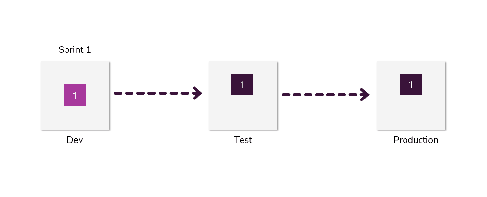
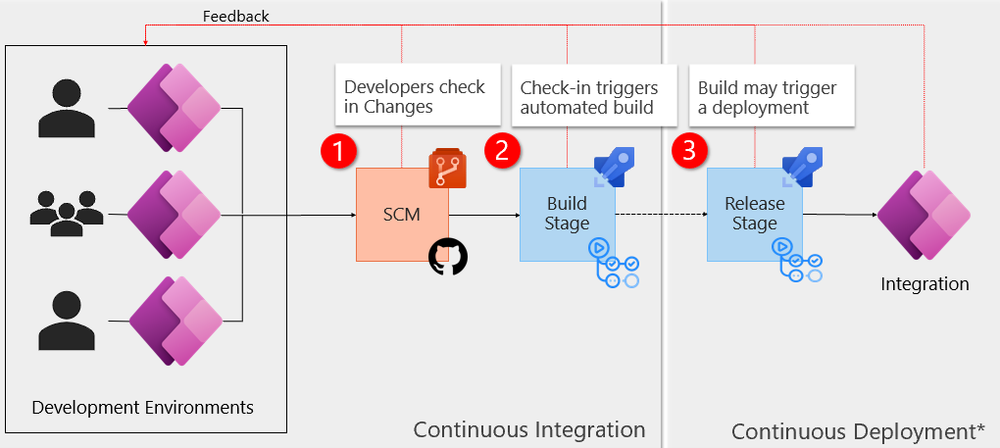
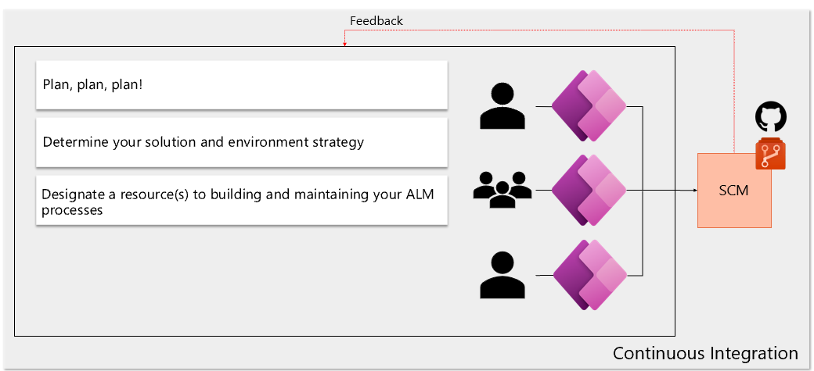

When deploying a new solution, you can use CI in both unmanaged and managed solutions. This unit will first talk about the common pattern developers follow when deploying a new unmanaged solution with each sprint, and then we'll share a more ideal pattern for team development.

Here's the common pattern that developers follow when deploying a new unmanaged solution with each sprint.

> [!div class="mx-imgBorder"]
> 

During the first sprint, things are clean at first. Adding solutions over time to keep release speeds fast by deploying only changes from the current sprint in an unmanaged solution. After several sprints, we start to have a breakdown in production where there's no longer a clear benefit for the logical separation between solutions. Typically, this is continued to gain deployment speeds. Eventually, things just fall apart in production with things becoming a mess of hundreds of solutions.

-   One can't track changes using this method

-   Speed improvements are marginal when compared to managed solution updates

There's a better way, that will address these concerns!

## A better pattern for team development

This setup can work with multiple development environments with one or many developers.

> [!div class="mx-imgBorder"]
> 

1. Changes in those environments are exported, then checked into source control.

1. The check-in action triggers an automated build process.

1. The build process may trigger a release process that moves our solutions to downstream environments.

## Modern approach to solution development

Let's discuss how continuous integration supports a modern way to develop solutions.

> [!VIDEO https://www.microsoft.com/videoplayer/embed/RE4VeDz]

## Support team development

Every software journey starts with a **plan**. Setting up ALM for the Power Platform isn't different.

**Planning** isn't a focus of this module, but it must be understood that to avoid many issues in co-development an effective process for work item planning must be in place.

-   Work items are minimal, specific, and time bound

-   Avoid overlap of components between components being developed in parallel

While it isn't a requirement to have a resource dedicated to maintaining ALM processes, it has been demonstrated to lead to better outcomes.

> [!div class="mx-imgBorder"]
> 
