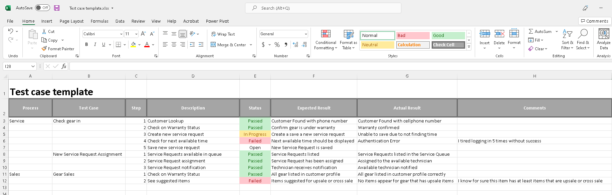

Remember that these test scenarios should be directly related to findings during the Planning and Designing phases we covered in previous modules, plus, unlike unit testing, which is completed programmatically end-to-end tests are performed by users so they must include enough detail so they understand the task at hand. The amount of detail changes from organization to organization. The bottom line is, you know your users, you know whether the name of the step contains enough information for a user that was selected for User Acceptance Testing to be able to perform the test, or whether you need to write a detailed "Script" that users can follow verbatim.

There are many tools that allow you to write the features and functions that must be tested and track detailed results. Here's an example of an Excel template:

> [!div class="mx-imgBorder"]
> 

Regardless of the tool used to track the progress in these tests, ensuring collaboration between participants can add tremendous clarity regarding who is testing which task and scenario.
