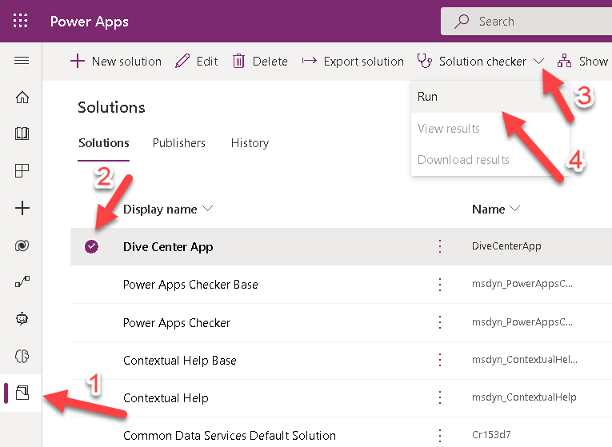
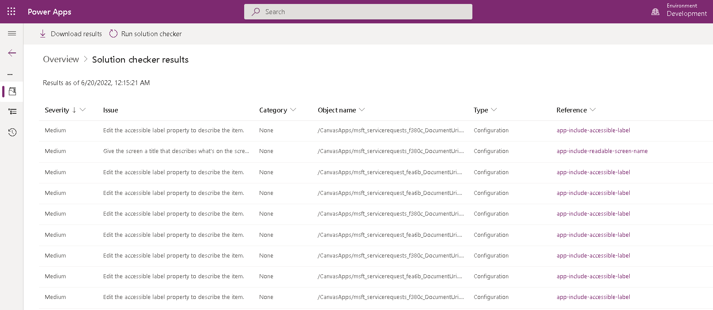

For this exercise, we'll test our solution to validate our apps in Power Apps. The solution checker will analyze custom workflow activities, web resources, and all Dataverse configurations, such as SDK message steps.

1.  Sign in to [Power Apps](https://make.powerapps.com/?azure-portal=true).

1.  On the left pane, select **Solutions**, then select the **Dive Center App** Solution we created in module 3, select to drop the **Solution Checker menu**, select **Run**.

	> [!div class="mx-imgBorder"]
	> 

1.  Wait until the **Solution Checker** has completed testing the solution.

1.  Select the **Dive Center App** Solution, select to drop the **Solution Checker menu**, select **View results**.

	> [!div class="mx-imgBorder"]
	> 

1.  Once the report opens, **notice the errors** collected by the Solution Checker and correct them as necessary.

	> [!div class="mx-imgBorder"]
	> 

> [!NOTE]
> This report can be downloaded for easier tracking.