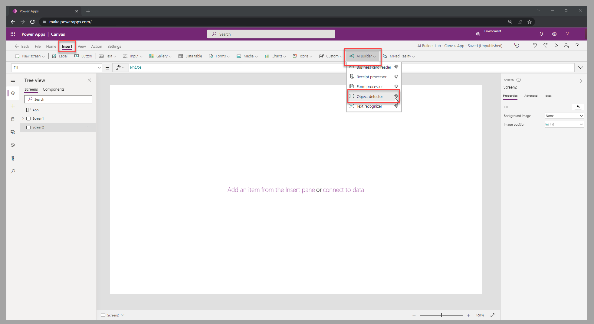

AI Builder custom model components can provide a rich user experience in your applications. You'll need to publish the referenced model before using it in a canvas app. In this unit, you'll learn about *object detection*, which allows the reader to detect recognizable objects in an image and use this information in the app.

## Add the object detector

The object detector is the AI Builder component that allows you to use the object detection custom model in a canvas screen. To add the object detector, follow these steps:

1. In the top menu for a selected screen in the canvas app studio, select the **Insert** tab.

1. In the **AI Builder** group, select **Object detector**.

> [!div class="mx-imgBorder"]
> 

## Set up the object detector

After you've selected the object detector that you want to add to the screen, you can choose from the following component properties to capture the results of the reader:

- **GroupedResults** - List of distinct, recognized images with a count. This property can help with inventory management.

- **Results** - List of all recognized images with a confidence score. This property can help you determine which of the images are considered valid (if confidence level is determined as valid for the business scenario).

The following video demonstrates the configuration steps by using two galleries to display the properties that you'd use to process an image with the object detector.

> [!VIDEO https://www.microsoft.com/videoplayer/embed/RE50ngO]
