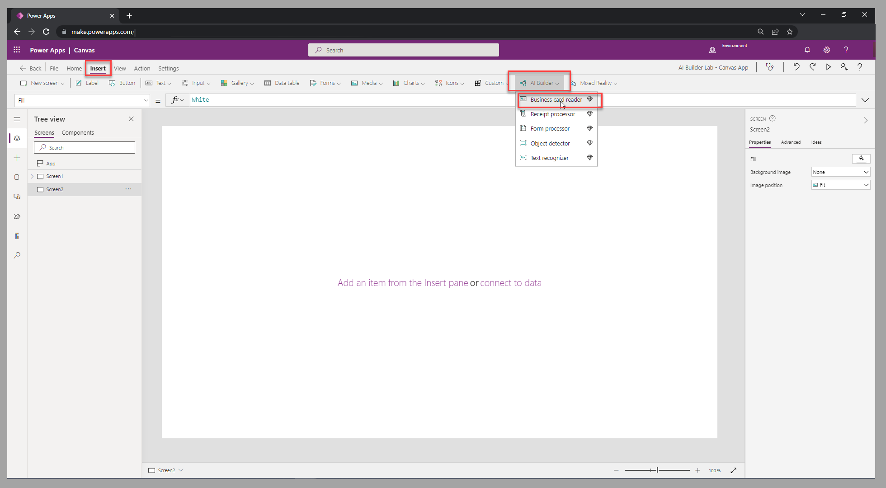

In addition to adding prebuilt model components to model-driven apps, you can include these components in a canvas app. In this unit, you'll add the **business card reader** component to a canvas app from Power Apps.

## Add the business card reader

To add the business card reader component to a canvas app, follow these steps:

1. In the top menu for a selected screen in the canvas app studio, select the **Insert** tab.

1. In the **AI Builder** group, select **Business card reader**.

> [!div class="mx-imgBorder"]
> 

## Set up the business card reader

After you've selected the business card reader component that you want to add to the screen, you'll need to capture the results of the reader. To capture these results, you’ll need to set up input fields on a form, or set up labels on the screen, and then link them to the business card reader values.

The following video demonstrates the configuration steps by using a form with a Microsoft Dataverse table that captures the information on a contact record.

> [!VIDEO https://www.microsoft.com/videoplayer/embed/]

You've now learned how to add a prebuilt model component to a canvas app. Next, you'll learn how to add a custom one.
