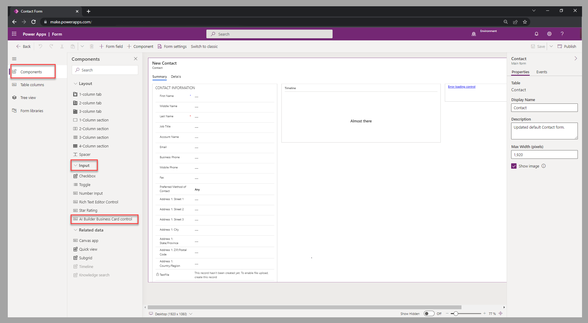

The prebuilt model components from AI Builder can provide a rich user experience in your applications. You can include these prebuilt components in a model-driven app from Power Apps. In this unit, you'll learn about the *business card reader*, which allows business card detection and extracts the card's information.

## Add the business card reader

Add the business card reader component to a model-driven form by following these steps:

1. In the left navigation pane of the model-driven form studio, for a selected form, go to the **Components** section and expand **Input**.

1. In the **Input** group, select **AI Builder Business Card control**.

    > [!div class="mx-imgBorder"]
    > 

## Set up the business card reader

After you've selected the business card reader component that you want to add to the form, you'll need to set up which table columns will serve as placeholders for the values that are detected from the business card. A text input column is also required as a placeholder for the component. No value will update this column, so even if the text input column is used elsewhere on the form, it's only to position the column on the form.

## Test the business card reader

The following video demonstrates the configuration steps and how you can test the component in your model-driven app.

> [!VIDEO https://www.microsoft.com/videoplayer/embed/RE50ngM]

You've now learned how to add a prebuilt model component to a model-driven app. Next, you'll learn how to add the same type of component to a canvas app.
