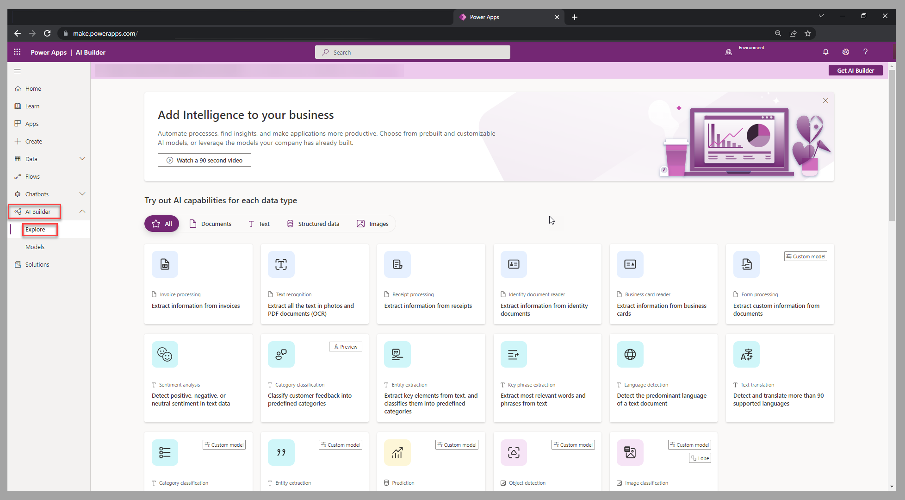
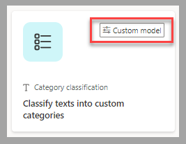
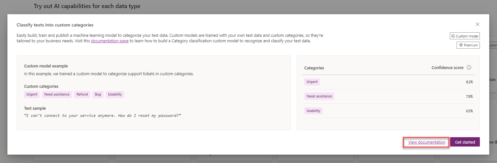
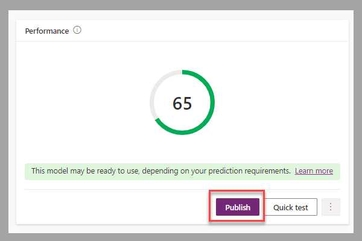

AI Builder offers a guided experience that explains how to create a custom model by following a few simple steps.

## Select a custom model

Sign in to Power Apps Studio or Power Automate Studio and then select **AI Builder > Explore** in the left navigation pane.

> [!div class="mx-imgBorder"]
> 

In the list of available models, you can identify custom models by a tag that's included in the tile that describes the model type and title.

> [!div class="mx-imgBorder"]
> 

## Create a custom model

After you select a custom model, AI Builder will guide you through the creation process.

If you're creating your first model for the selected type, or if you need to review the steps for creating and using the model, a link to the official documentation will be provided.

> [!div class="mx-imgBorder"]
> 

Make sure that you have everything that you need to create your model. You can also use [sample data](/ai-builder/samples/?azure-portal=true) to create the models. When you're ready, select the **Get started** button and follow the guided steps that are specific to the selected model.

## Follow the guided experience

Every model type has its own set of steps for creating a model. The following video demonstrates the steps for training and publishing a custom model, which in this case is **Category Classification**.

> [!VIDEO https://www.microsoft.com/videoplayer/embed/RE50AqL]

## Publish your model

Allow the training to finish. When you've determined that the performance level of your custom model is adequate for your business scenario, you can publish this model to make it available for the applicable Microsoft Power Platform tools.

> [!div class="mx-imgBorder"]
> 

Now, you've learned how to create a custom model. Next, you'll learn how to add a prebuilt model component to a model-driven app.
