In this exercise, you'll learn how to import rows from a text file into an existing Dataverse table by using Power Query.

## Scenario 

You work at a bicycle store and are responsible for your company's Dataverse environment.

The sales manager provides you with a list of potential accounts that could become franchise owners to expand the store's market presence. You must import this list into Dataverse and identify the accounts as potential franchise owners.

## Prepare the account table

To identify potential franchise owners, you need to add a column to the core account table.

In a Dataverse environment where you can proceed with modifications to the tables, such as a dedicated training or development environment, follow these steps:

1.  Sign in to the [Power Apps portal](https://make.powerapps.com/?azure-portal=true).

1.  In the left pane, expand **Dataverse** and select **Tables**.

	> [!div class="mx-imgBorder"]
	> 

1.  In the list of tables, select **Account**.

	> [!div class="mx-imgBorder"]
	> 

1.  In the Power Apps portal, for the Account table, select **Columns**.

	> [!div class="mx-imgBorder"]
	> [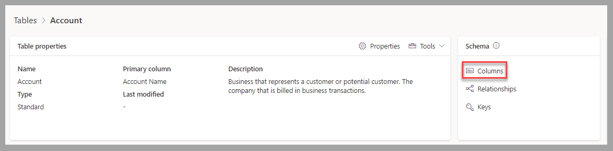](../media/columns.png#lightbox)

1.  For the Account table, select **+ New column**.

	> [!div class="mx-imgBorder"]
	> [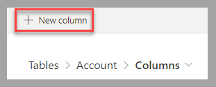](../media/new-column.png#lightbox)

1.  In the new column form, enter a **Display name**, such as Potential Franchisee. Select **Yes/No** selection within the **Choice** options for the data type. Select **Save** to proceed to the next step.

	> [!div class="mx-imgBorder"]
	> [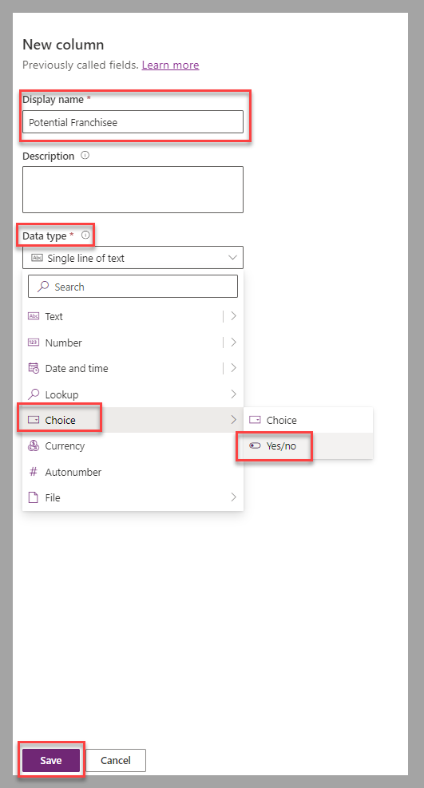](../media/new-column-settings.png#lightbox)

## Prepare data

A comma-separated values (CSV) file that contains accounts as potential franchise owners is available to [download](https://github.com/MicrosoftDocs/mslearn-developer-tools-power-platform/blob/master/power-apps/visualize-import-export-Dataverse/Potential%20Franchise%20Owners.zip).

For this exercise, the file must be uploaded to a OneDrive for Business folder you have access to.

## Exercise

Now that the account table is modified and the potential franchise owners file is available, you can create the dataflow.

In a Dataverse environment where you can proceed without impacting others in your company, such as a dedicated training or development environment, follow these steps:

1.  From the dataflow page in Power Apps Studio, select **+ New dataflow**.

	> [!div class="mx-imgBorder"]
	> 

1.  In the New dataflow window, enter a name for the new dataflow, such as Potential Franchise Owner, and then select **Create**.

	> [!div class="mx-imgBorder"]
	> [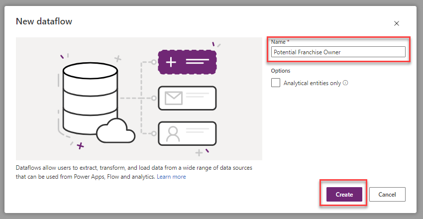](../media/name.png#lightbox)

1.  From the **Choose Data Source** window in Power Query, select the **Text/CSV** tile.

	> [!div class="mx-imgBorder"]
	> [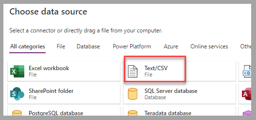](../media/text.png#lightbox)

1.  From the **Connect to data source** form, select **Browse OneDrive** to browse and identify the file that contains the list of accounts to import. Select **Next** to complete this step.

	> [!div class="mx-imgBorder"]
	> [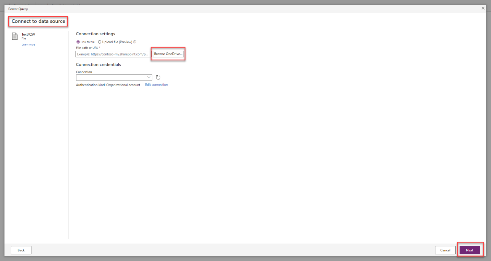](../media/browse.png#lightbox)

1.  In the **Preview file data** form, select **Transform data**.

	> [!div class="mx-imgBorder"]
	> [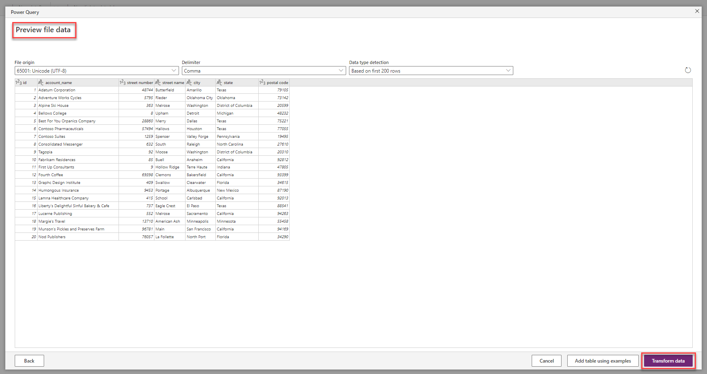](../media/transform-data.png#lightbox)

1.  The first transformation step is to concatenate the street number and street name into a single column. From the **Add column** section, select **From selection** under **Column from examples**.

	> [!div class="mx-imgBorder"]
	> [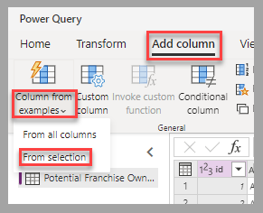](../media/selection.png#lightbox)

1.  Select **street number** and **street name** column headings. In the new column, enter the street number and name values to generate a transform formula. Change the column heading of this new column to **Street Line 1** so it will be easy to recognize later in the import process. Select **OK** to proceed to the next step.

	> [!div class="mx-imgBorder"]
	> [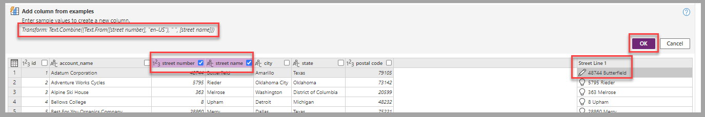](../media/transform-formula.png#lightbox)

1.  The second transformation step is to indicate that the imported accounts are potential franchise owners. From the **Add column** section, select **Custom column**.

	> [!div class="mx-imgBorder"]
	> [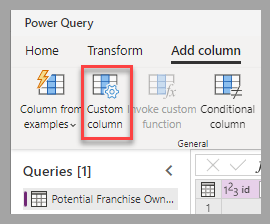](../media/custom-column.png#lightbox)

1.  In the Custom column form, define the new column name such as Potential Franchisee, set **Custom column formula** to **true**, and set the **Data type** to **True/False**. Select **OK** to proceed to the next step.

	> [!div class="mx-imgBorder"]
	> [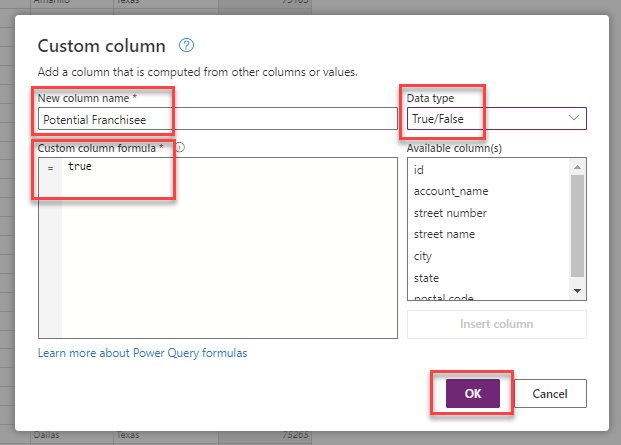](../media/column-settings.png#lightbox)

1. With transform operations complete, select **Next** to proceed to the next step.

	> [!div class="mx-imgBorder"]
	> [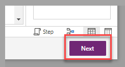](../media/next.png#lightbox)

1. To update the account table with the new rows, select **Load to existing table** and then select **account** as the destination table.

	> [!div class="mx-imgBorder"]
	> [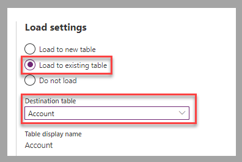](../media/existing-table.png#lightbox)

1. Configure the address values under **Column mapping**. Select **city**, **Street Line 1**, **postal code**, and **state** for the applicable account table columns.

	> [!div class="mx-imgBorder"]
	> [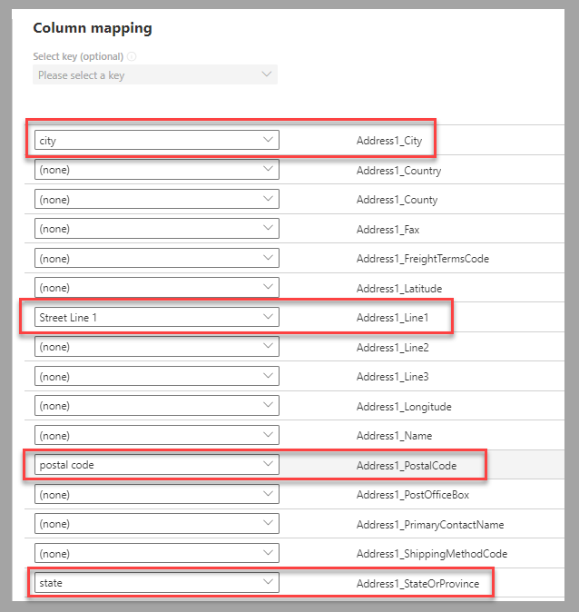](../media/column-mapping.png#lightbox)

1. Configure the company name values under **Column mapping**. Select **account_name** for the applicable account table column.

	> [!div class="mx-imgBorder"]
	> [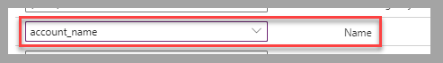](../media/account-name.png#lightbox)

1. Configure the potential franchise owner flag under **Column mapping**. Select **Potential Franchisee** for the newly created account table column.

	> [!div class="mx-imgBorder"]
	> [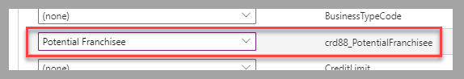](../media/potential-franchisee.png#lightbox)

1. With the column mapping completed, select **Next** to proceed to the next step.

	> [!div class="mx-imgBorder"]
	> [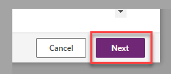](../media/next-button.png#lightbox)

1. The last step is to configure the refresh settings. For the current scenario, which is a one-time event, select **Refresh manually**, and then select **Publish** to complete the creation of the dataflow.

	> [!div class="mx-imgBorder"]
	> [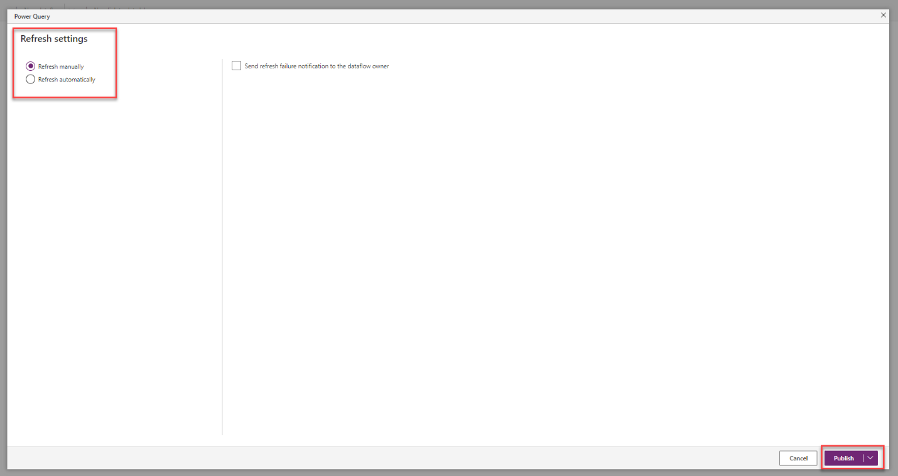](../media/refresh-settings.png#lightbox)

1. Wait for the dataflow status to appear as **Published** and **Last Refresh** to be confirmed with a green checkmark.

	> [!div class="mx-imgBorder"]
	> [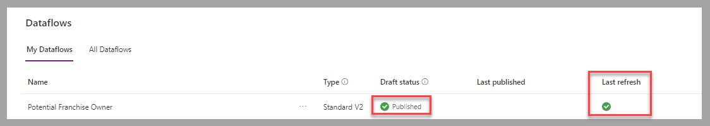](../media/published.png#lightbox)

1. In the left pane, expand **Dataverse**, and then select **Tables**. In the list of tables, select **Account**.

	> [!div class="mx-imgBorder"]
	> [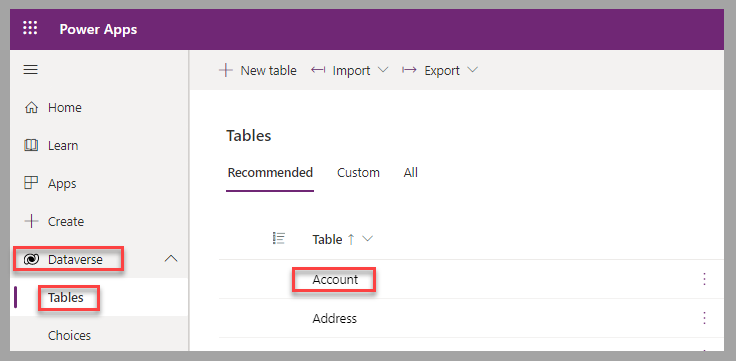](../media/tables-account.png#lightbox)

1. Under **Account columns and data** note the imported records, including the **Potential Franchisee** values set to **Yes**.

	> [!div class="mx-imgBorder"]
	> [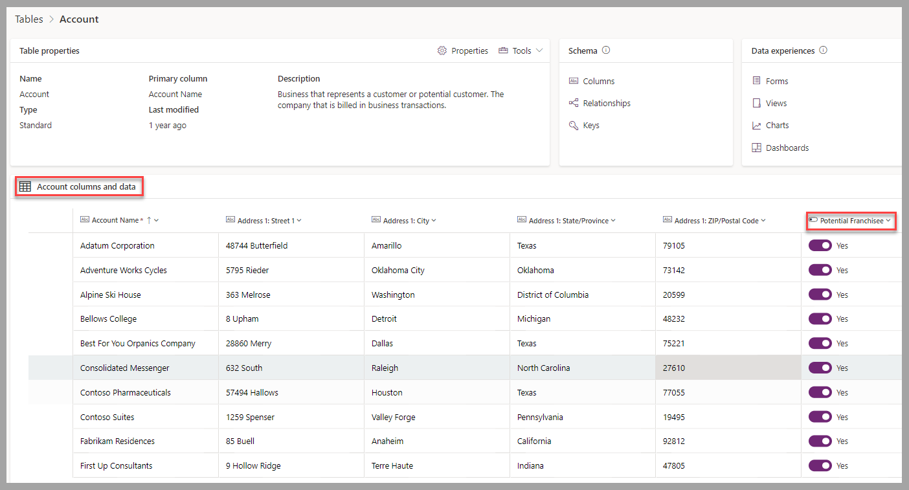](../media/columns-data.png#lightbox)

## Exercise steps (video)

In the following video, you're taken through the steps for this exercise.

> [!VIDEO https://www.microsoft.com/videoplayer/embed/RE59os1]

## Next steps

You now have learned how to create a dataflow by using Power Query to import new rows from a static text file into an existing Dataverse table. You also learned how to add new columns by using transformation and static values. Next, you'll learn how to import dynamic data into a Dataverse table by using Power Query.
