In this exercise, you'll apply your learned knowledge to create a dataflow by using Power Query to import an Excel spreadsheet that contains a list of conference attendees. New conferences are organized on a monthly basis, on the same day of the month. You've been assigned the task to create the dataflow and configure it to refresh after every conference.

## Prepare the contact table

To ensure that attendees are identified based on their email addresses and that contacts aren't added if they already exist in the contact table, you should create a unique index for the email column.

> [!IMPORTANT]
> For the creation of the unique key to complete successfully, you must ensure that there are no duplicate records with the same email address in the contact table of your environment.

In a Dataverse environment where you can proceed with modifications to the tables, such as a dedicated training or development environment, follow these steps:

1.  Sign in to the [Power Apps portal](https://make.powerapps.com/?azure-portal=true).

1.  In the left pane, expand **Dataverse** and select **Tables**.

	> [!div class="mx-imgBorder"]
	> [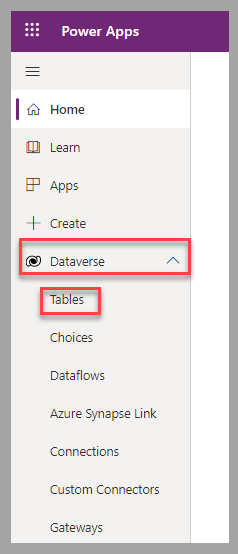](../media/dataverse-tables.png#lightbox)

1.  In the list of tables, select **Contact**.

	> [!div class="mx-imgBorder"]
	> [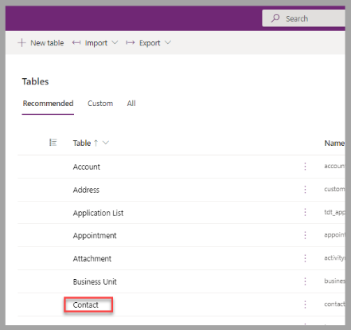](../media/contact.png#lightbox)

1.  In the Power Apps portal, for the Contact table, select **Keys** under **Schema**.

	> [!div class="mx-imgBorder"]
	> [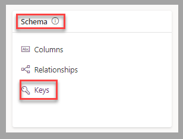](../media/schema-keys.png#lightbox)

1.  For the Contact table, select **+ New key**.

	> [!div class="mx-imgBorder"]
	> [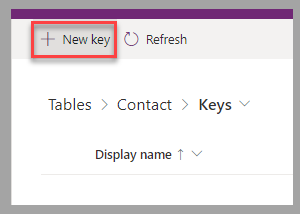](../media/new-key.png#lightbox)

1.  Enter a **Display name** for the key, such as Unique Email Address. Select the **Email** column, and then select **Save** to proceed to the next step.

	> [!div class="mx-imgBorder"]
	> [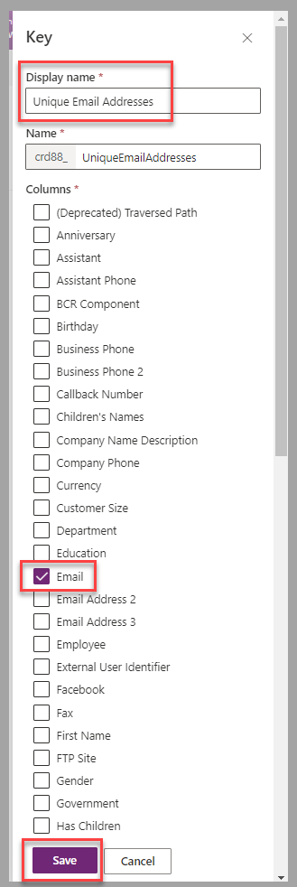](../media/email.png#lightbox)

1.  The process that creates the key can take a few minutes to complete. To confirm successful completion, select **Refresh** until the status changes to **Active**.

## Prepare data

An Excel spreadsheet that contains a list of event attendees is available to [download](https://github.com/MicrosoftDocs/mslearn-developer-tools-power-platform/blob/master/power-apps/visualize-import-export-Dataverse/Conference%20Attendees.xlsx).

For this exercise, the file must be uploaded to a OneDrive for Business folder you have access to.

## Exercise

In a Dataverse environment where you can proceed without impacting others in your company, such as a dedicated training or development environment, follow these steps:

1.  From the dataflow page in Power Apps Studio, select **+ New dataflow**.

	> [!div class="mx-imgBorder"]
	> [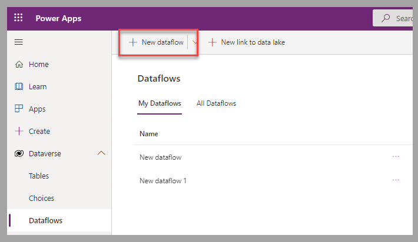](../media/new-dataflow.png#lightbox)

1.  In the New dataflow window, enter a name for the new dataflow, such as Add Conference Attendees to Contact Table, and then select **Create**.

	> [!div class="mx-imgBorder"]
	> [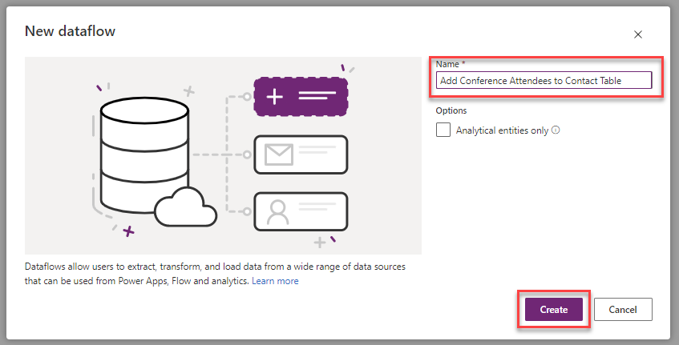](../media/dataflow-name.png#lightbox)

1.  From the **Choose Data Source** window of the Power Query editor, select **Text/CSV** tile.

	> [!div class="mx-imgBorder"]
	> [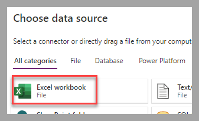](../media/excel.png#lightbox)

1.  From the **Connect to data source** form, select **Browse OneDrive** to browse and identify the file that contains the list of contacts to import. Select **Next** to complete this step.

	> [!div class="mx-imgBorder"]
	> [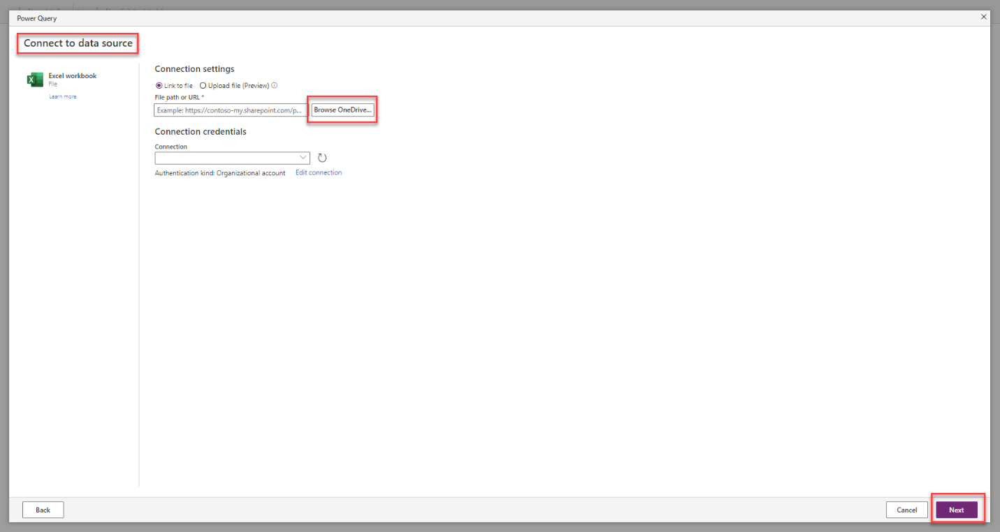](../media/browse-connection.png#lightbox)

1.  In the **Choose data** form, select the Excel table or workbook that contains the list of attendees to import (**AttendeeList** in the sample file), and then select **Transform data**.

	> [!div class="mx-imgBorder"]
	> [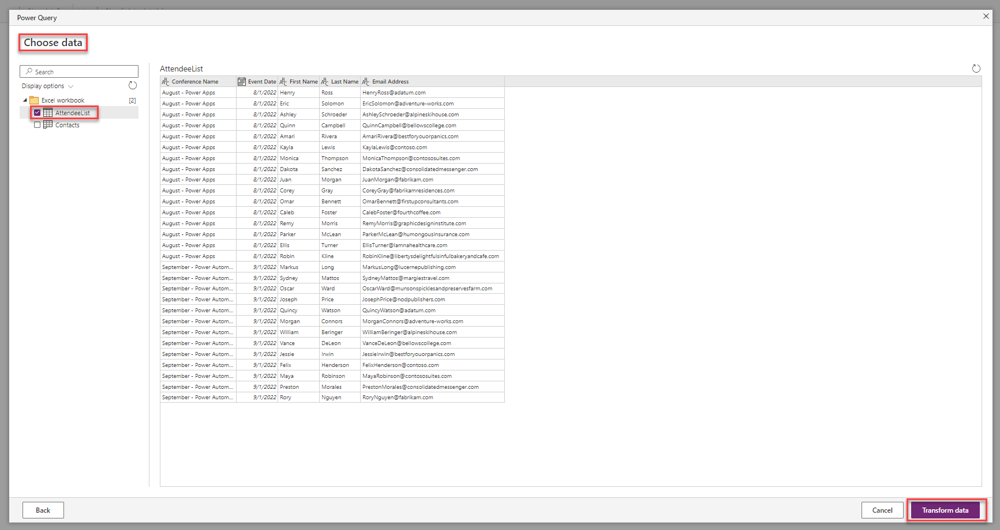](../media/attendee-list.png#lightbox)

1.  For this scenario, no transformation is required. Select **Next** to proceed to the next step.

	> [!div class="mx-imgBorder"]
	> [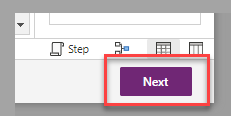](../media/next-step.png#lightbox)

1.  To update the contact table with the new rows, select **Load to existing table**, and then select **contact** as the destination table.

	> [!div class="mx-imgBorder"]
	> [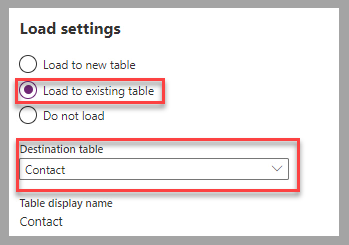](../media/destination-table.png#lightbox)

1.  Configure the **Column mapping**. Select **Unique Email Addresses (EmailAddress1)** as the **Select key** .Select **Email Address**, **First Name**, and **Last Name** for the applicable account table columns. Select **Publish** to complete this step.

	> [!div class="mx-imgBorder"]
	> [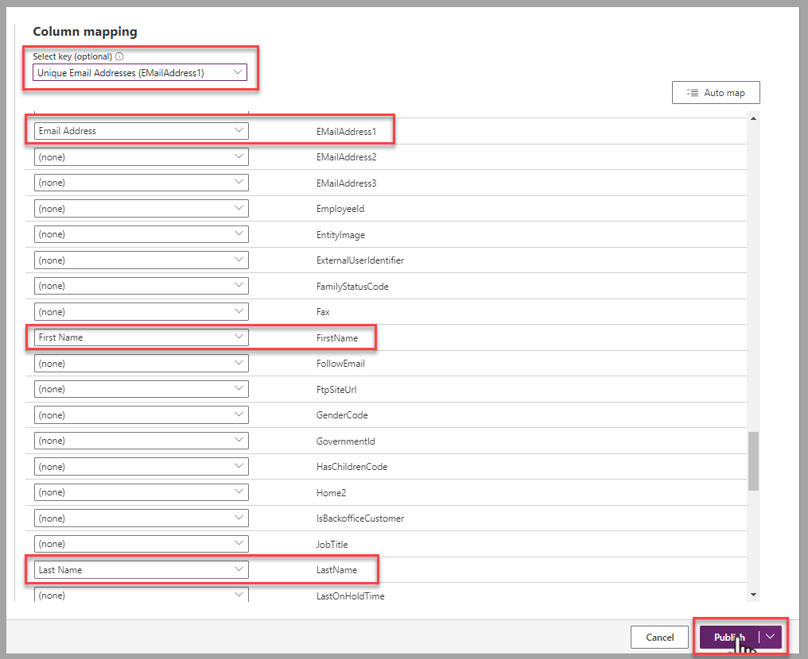](../media/configured-column-mapping.png#lightbox)

1.  The next step is to configure the **Refresh settings**. For the current scenario, which requires a monthly refresh, select **Refresh automatically**, then set **Frequency-based refresh** to **Refresh every 1 months** with a start date and time of today. Select **Publish** to complete the creation of the dataflow.

	> [!div class="mx-imgBorder"]
	> [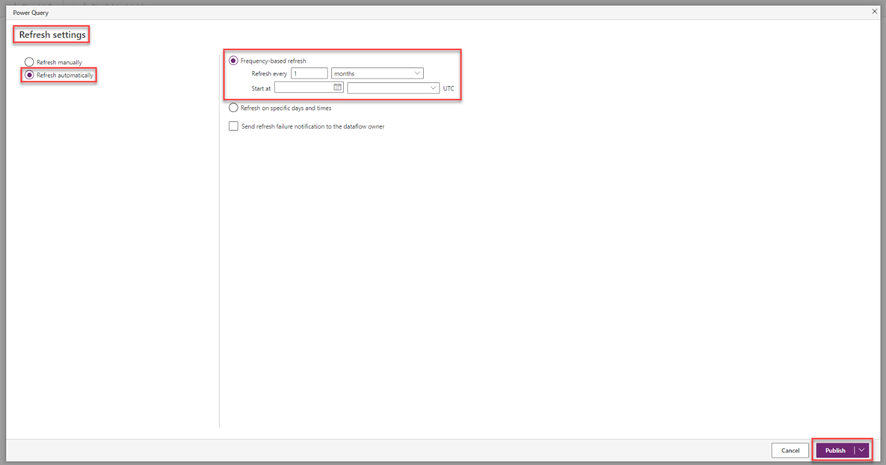](../media/frequency-based-refresh.png#lightbox)

1. Wait for the dataflow status to be published and **Last Refresh** to be confirmed with a green checkmark.

	> [!div class="mx-imgBorder"]
	> [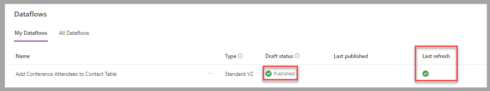](../media/published-status.png#lightbox)

1. Configure the refresh to process only the last month's event. For the newly created dataflow, select **Edit incremental refresh** by using the ellipsis.

	> [!div class="mx-imgBorder"]
	> 

1. On the **Incremental refresh settings** page, select **Incremental refresh**, and then select the **Event Date** column from the spreadsheet as the column to filter on. Configure **Refresh rows from the past** to be **1 Months**. Select **Save** to complete this step.

	> [!div class="mx-imgBorder"]
	> [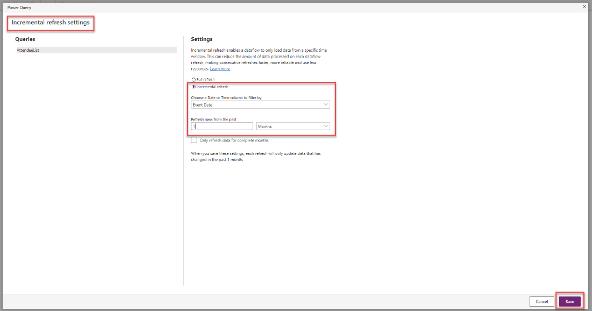](../media/incremental-refresh.png#lightbox)

1. In the left pane, expand **Dataverse** and select **Tables**. In the list of tables, select **Contact**.

	> [!div class="mx-imgBorder"]
	> 

	You can find the imported records under **Contact columns and data**.

	> [!div class="mx-imgBorder"]
	> [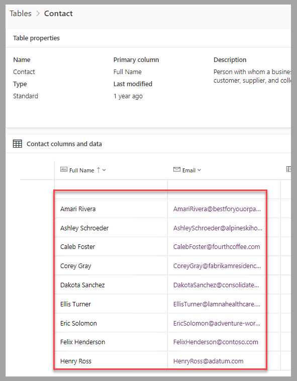](../media/imported-rows.png#lightbox)

## Exercise steps (video)

In the following video, you're taken through the steps for this exercise.

> [!VIDEO https://www.microsoft.com/videoplayer/embed/RE59BmZ]  

## Next steps

You now have learned how to create a dataflow based on Power Query that imports dynamic data to a Dataverse table. Next, you'll have the opportunity to validate the learned concepts for this module.
