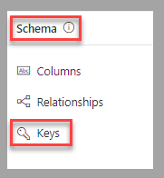
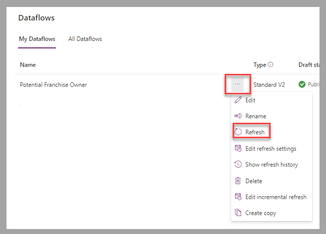
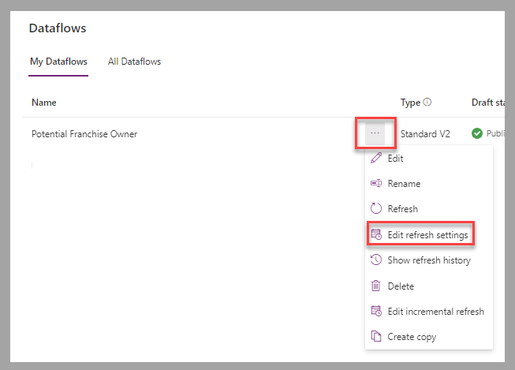
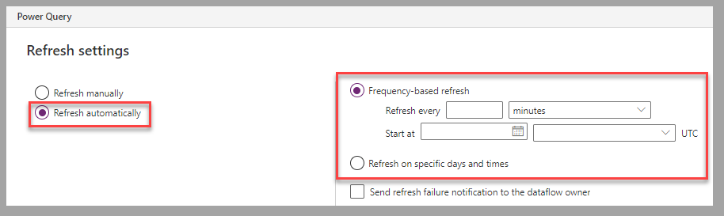
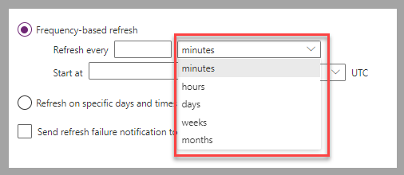
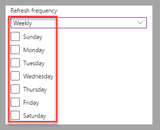
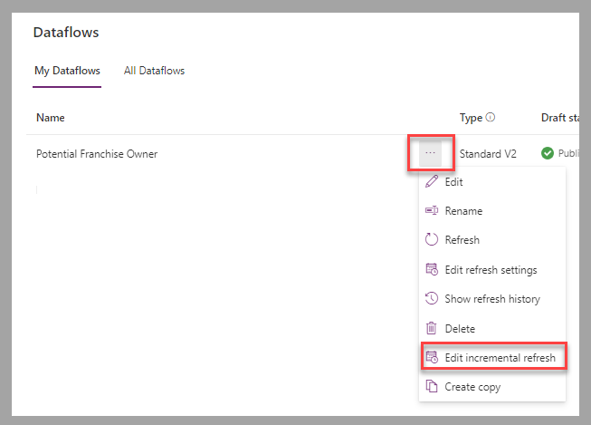
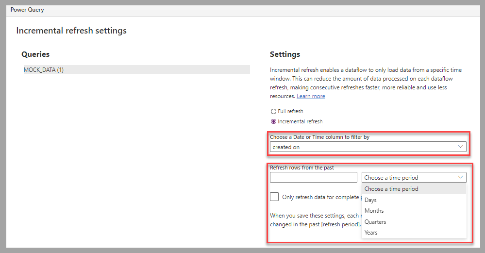

By now, you've reviewed how to create a dataflow by using Power Query to import a static file into a Dataverse table. In many cases, the source data changes over time, and the business scenario requires a frequent update of the data in Dataverse based on that dynamic data source.

## Refresh data 

A dataflow can update the destination table based on updates of the source table or file. To properly match rows from the two sets, a unique ID column must be part of both tables. In many cases, this column is defined as an alternate key in the destination table. In Dataverse, alternate keys are configured via the **Keys** option in the **Schema** section of the table.

> [!div class="mx-imgBorder"]
> 

You can trigger a manual refresh by selecting **Refresh** for a specific dataflow.

> [!div class="mx-imgBorder"]
> 

To change the refresh frequency, select **Edit refresh settings** for the specific dataflow.

> [!div class="mx-imgBorder"]
> 

For dataflows that are required to be processed automatically, select **Refresh automatically**, and then configure **Frequency-based refresh** or **Refresh on specific days and times** based on the business scenario.

> [!div class="mx-imgBorder"]
> 

For frequency-based refresh scenarios, you can configure the frequency to occur every x number of **minutes**, **hours**, **days**, **weeks**, or **months**.

> [!div class="mx-imgBorder"]
> 

For scenarios that require refresh to occur on specific days and time, you can set the refresh frequency daily. In such cases, the refresh will be triggered at the configured time every day. For scenarios where **Refresh frequency** is set to **Weekly**, the days of the week when the refresh must be triggered can be selected.

> [!div class="mx-imgBorder"]
> 

For data sources that have large quantities of data, you may want to change the incremental refresh settings that are configured to process a full refresh by default. To access this configuration, select **Edit** **incremental refresh** for the specific dataflow.

> [!div class="mx-imgBorder"]
> 

A date or time column is required from the source to configure the filter for the incremental refresh. The filter can be configured to process rows for x number of **Days**, **Months**, **Quarters**, or **Years**.

> [!div class="mx-imgBorder"]
> 

## Next steps 

You now have learned how a dataflow refreshes the data automatically from a dynamic data source. Next, you'll learn how to update the contact table in Dataverse based on an Excel spreadsheet that is updated during conferences with the list of attendees.
