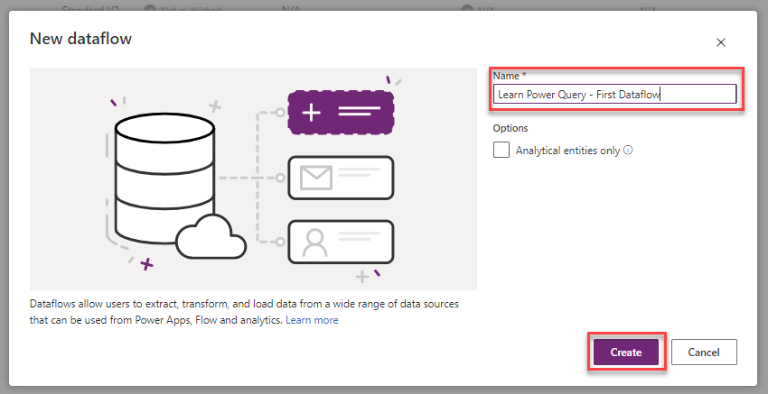
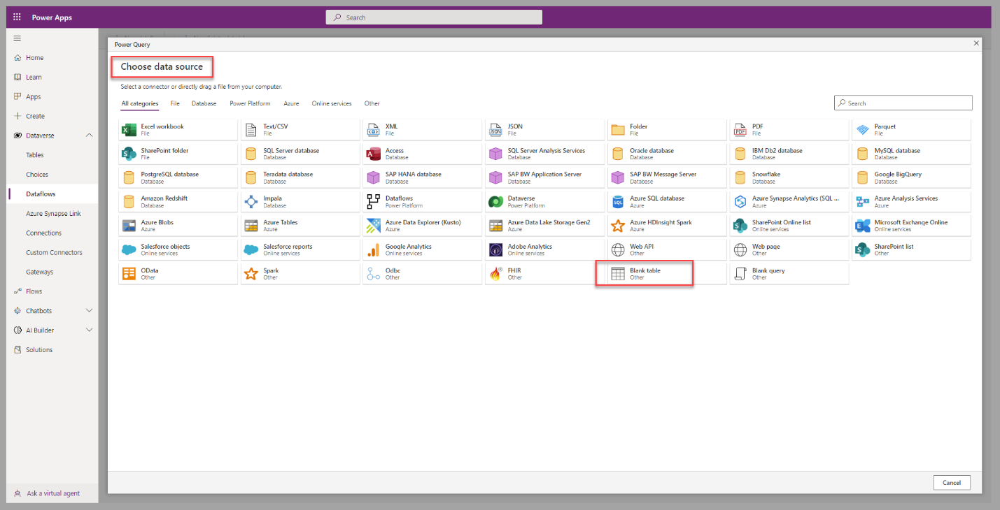
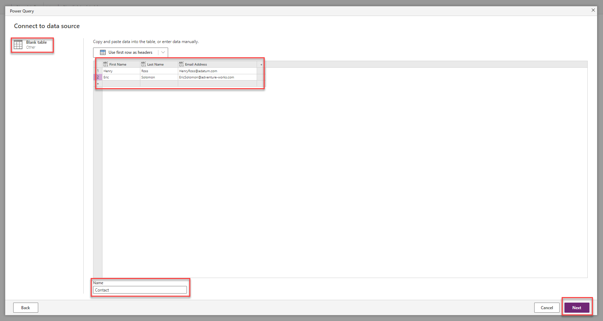
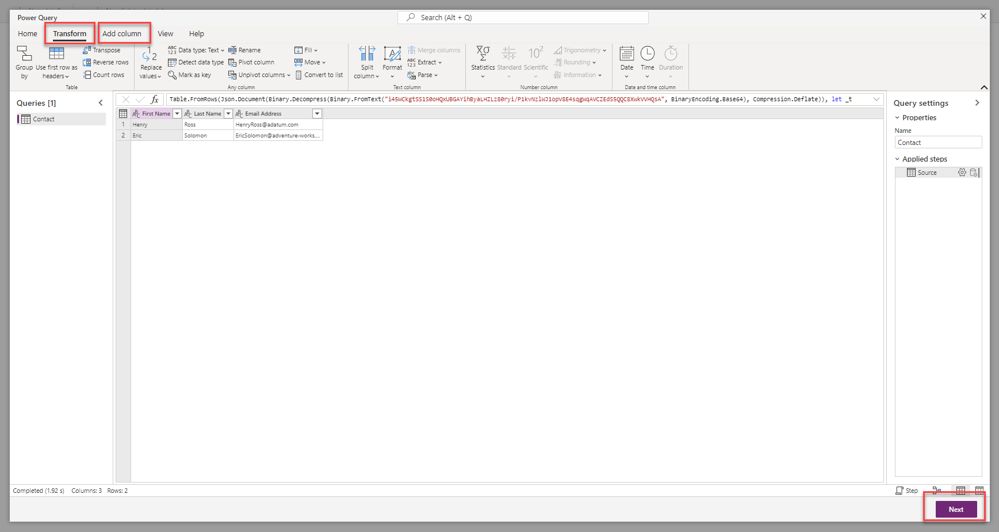
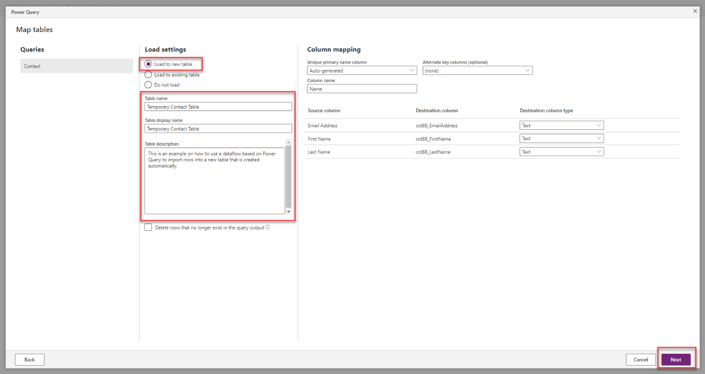
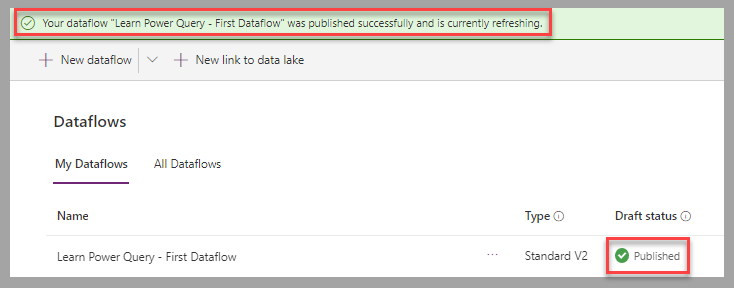
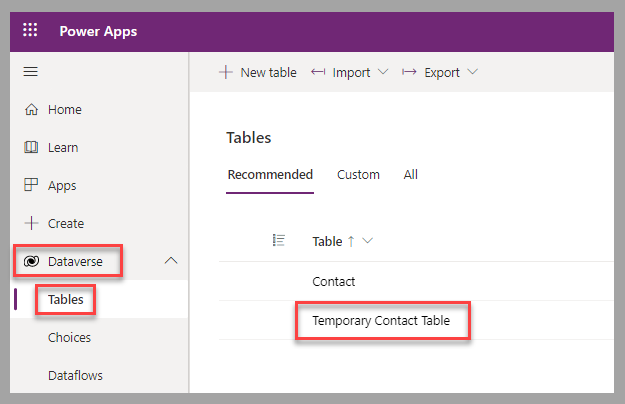

After following the initial steps presented in Unit 1, you can access the dataflows page. In this unit, you'll be presented with the process to import static data, such as manually entered, into a Dataverse table by using Power Query.

In this scenario, you have a list of contacts (first name, last name, and email addresses) that need to be imported into a temporary Dataverse table for review. This list of contacts could be in a text file or added manually.

A dataflow is created in Power Apps Studio for this process.

## Create a dataflow by using Power Query

To create a dataflow that imports data in Dataverse by using Power Query, follow these steps:

1.  From the dataflow page in Power Apps Studio, select **+ New dataflow**.

	> [!div class="mx-imgBorder"]
	> 

1.  In the New dataflow window, enter a name for the new dataflow, and then select **Create**.

	> [!div class="mx-imgBorder"]
	> 

1.  From the **Choose Data Source** window of the Power Query, select the data source for your business scenario; for example, select **Blank table**, which allows you to manually define a table structure and add rows to it.

	> [!div class="mx-imgBorder"]
	> 

1.  With this next step, you connect to a data source. Credentials and details about the data source may be required, depending on the selected data source. In some cases, such as the **Blank table** option selected in the previous step, you can define information about the data structure and rows. Column names, such as **First Name**, **Last Name**, and **Email Address**, can be added to the definition of a table, such as one named **Contact**. Select **Next** to complete this step.

	> [!div class="mx-imgBorder"]
	> 

1.  The next step allows you to transform the data and add columns, based on calculations, groupings, or transformation of other columns of the data source. Select **Next** to complete this step.

	> [!div class="mx-imgBorder"]
	> 

1.  A Map tables form is displayed. By default, the **Load to a new table** setting is selected. This allows the process to import data into a table, usually a temporary one that is created by the dataflow. For our current scenario, enter a **Table name**, **Table display name**, and **Table description.** The column mapping doesn't require modifications. Select **Next** to complete this step.

	> [!div class="mx-imgBorder"]
	> 

1.  The last step of dataflow creation is to configure the refresh settings. Dataflows can be refreshed on demand (**Refresh manually**) or on a predetermined schedule (**Refresh automatically**). Select **Publish** to complete the creation of the dataflow.

	> [!div class="mx-imgBorder"]
	> 

	The new dataflow will be part of the list of dataflows with a **Published** status and send a notification that confirms the process is complete.

	> [!div class="mx-imgBorder"]
	> 

1.  To access the newly created table, in the left pane, expand **Dataverse** and select **Tables**.

	> [!div class="mx-imgBorder"]
	> 

## Next steps

You now have learned how to create a dataflow that imports manually entered data into a new Dataverse table by using Power Query. Next, you'll learn how to add new accounts from a text file into an existing Dataverse table.
