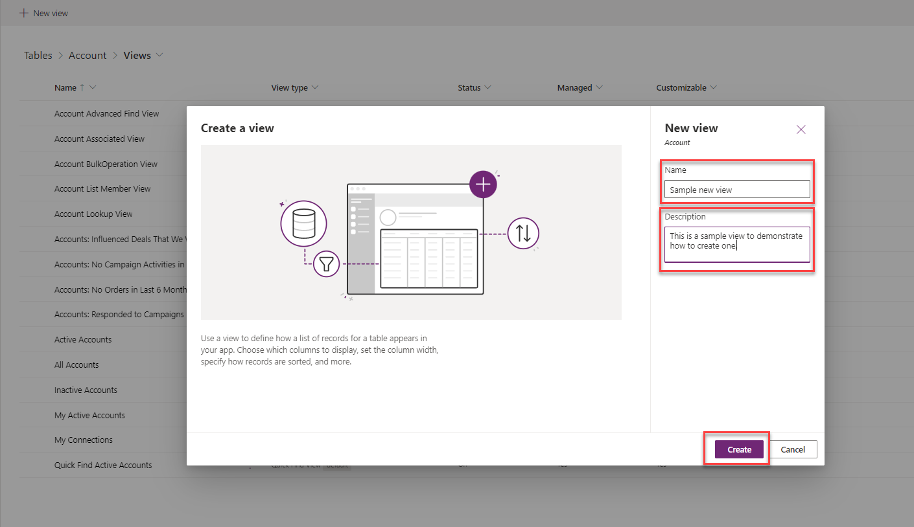
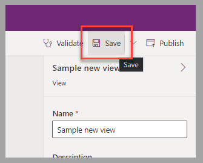
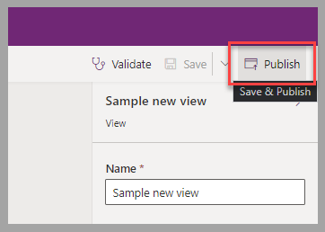
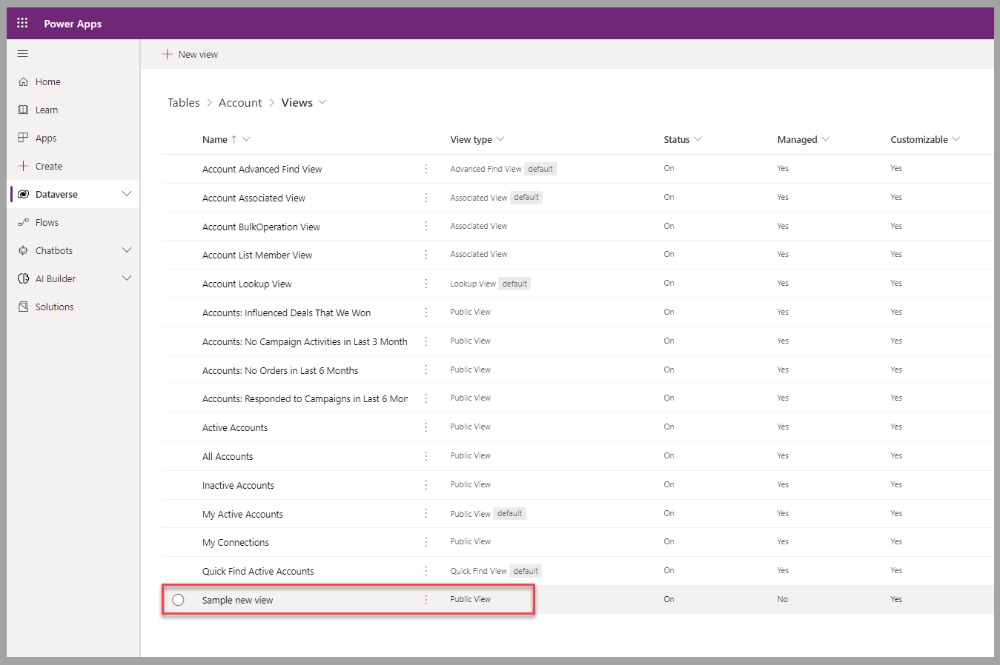
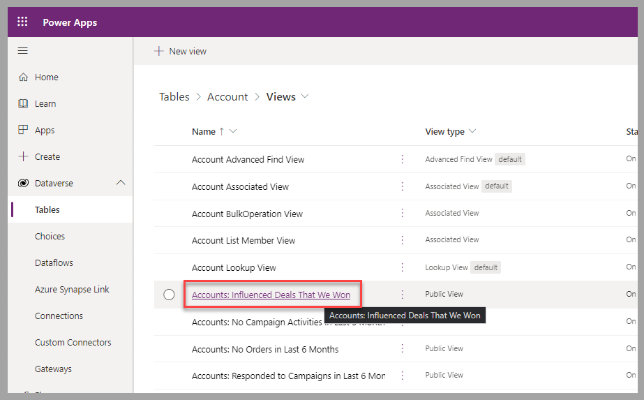
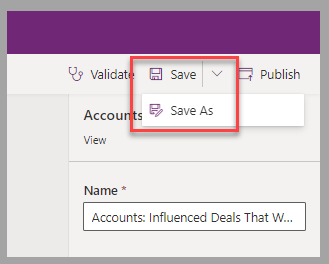
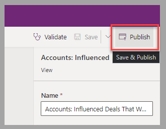

Your next task is to create a new view for a table or edit an existing one.

## Create a view

To create a view for a table in Power Apps maker portal, in the table's view list, follow these steps:

1. Select **New view**.

    > [!div class="mx-imgBorder"]
    > 

1. Provide a **Name** and **Description** for the view and then select **Create**.

    > [!div class="mx-imgBorder"]
    > 

1. You're now in the view designer. The next units explore more in depth the different features of this area. For now, select **Save** to proceed.

    > [!div class="mx-imgBorder"]
    > 

1. To render the view available to all other Power Apps users, select **Publish**.

    > [!div class="mx-imgBorder"]
    > 

After you've closed the view designer, the newly created view will be added to the list of views that are related to the table.

   > [!div class="mx-imgBorder"]
   > 

## Edit a view

To modify a view for a table in Power Apps maker portal, in the table's view list, follow these steps:

1. Select the name of the view to edit.

    > [!div class="mx-imgBorder"]
    > 

1. After modifications have been completed, select **Save** to override the existing view, or select **Save As** to create a new view under a different name.

    > [!div class="mx-imgBorder"]
    > 

1. To render the modifications to the view that's available to all other Power Apps users, select **Publish**.

    > [!div class="mx-imgBorder"]
    > 

## Next steps

Now that you've learned how to create and edit Dataverse table views, you'll learn how to add columns to an existing view, namely the **Active Accounts** view.
