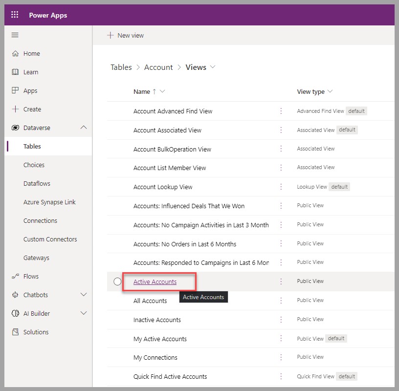
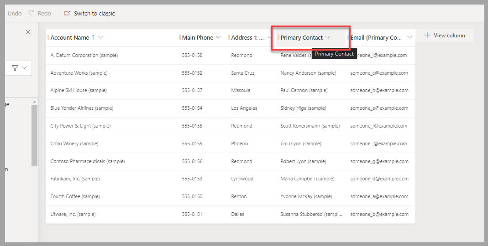
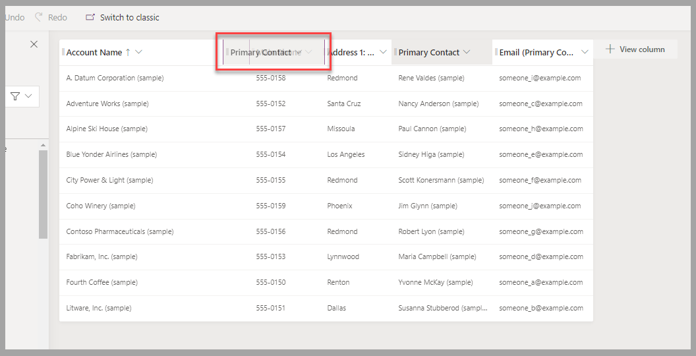
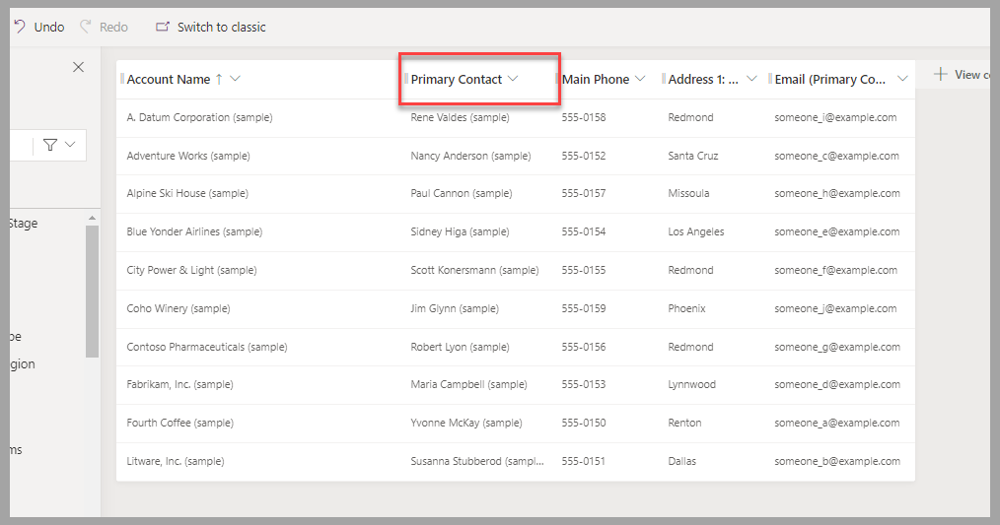
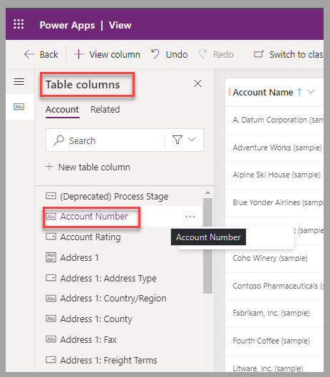
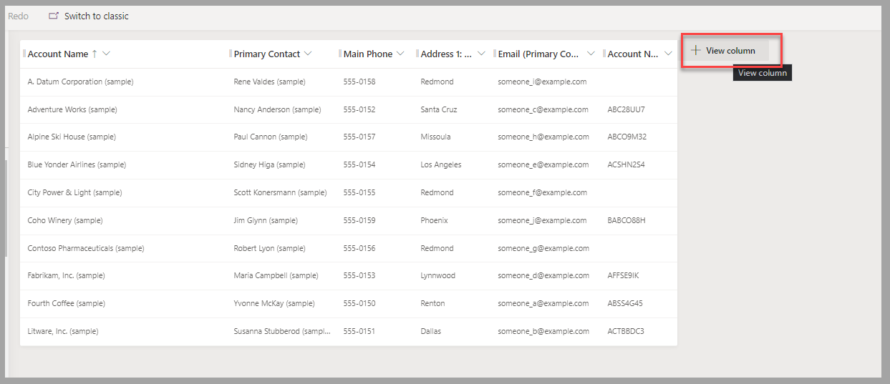
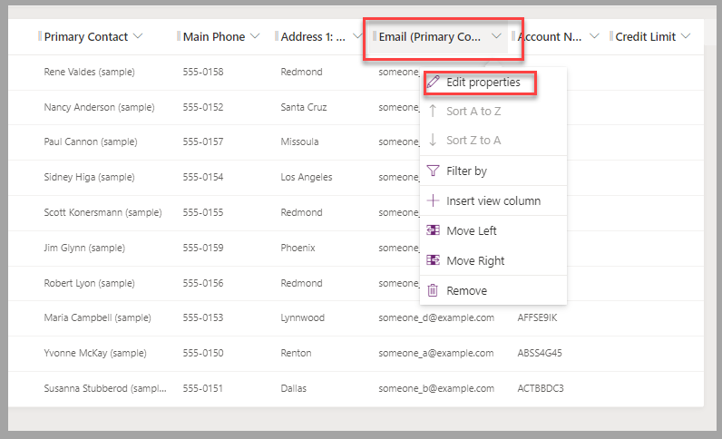
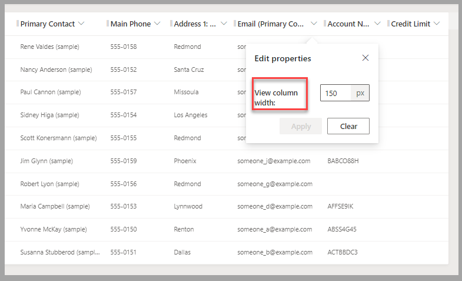
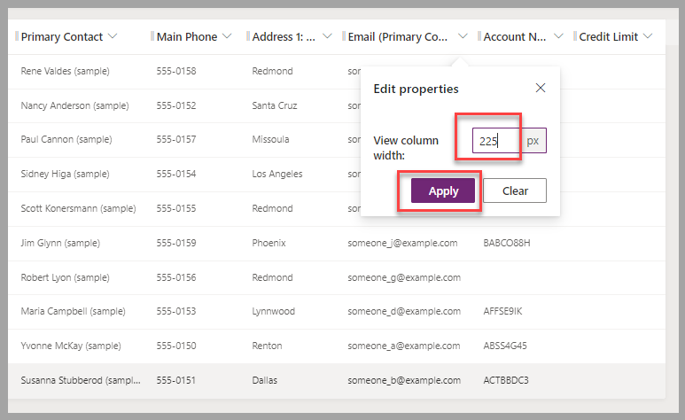
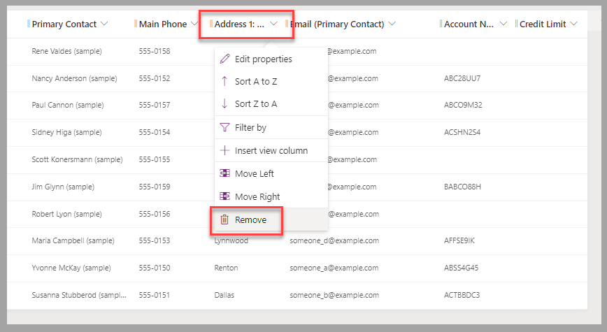

In this exercise, you'll learn how to add columns to an existing view.

## Scenario

You work at a bicycle store and are responsible for your organization's Dataverse environment.

The purchase department employees are using a Power Apps app that you built for them, to manage providers and orders. After they use this system for a few weeks, the employees request modifications to it.

For the list of accounts that is presented to them, the employees want to:

- Move Primary contact next to the account name.

- Add the account number and credit limit as the last columns.

- Resize the email column to be wider (about 150 percent of current size).

- Remove the city column.

## Exercise

In a Dataverse environment where you can proceed with modifications to the tables, such as dedicated training or development environment, follow these steps:

1. Sign in to the [Power Apps portal](https://make.powerapps.com/?azure-portal=true).

1. In the left pane, expand **Dataverse** and select **Tables**.

    > [!div class="mx-imgBorder"]
    > 

1. In the list of tables, select **Account**.

    > [!div class="mx-imgBorder"]
    > 

1. In the Power Apps portal, for the Account table, select **Views**.

    > [!div class="mx-imgBorder"]
    > 

1. Select the **Active Accounts** view.

    > [!div class="mx-imgBorder"]
    > 

1. Move the contact name to the requested location. Select the **Primary Contact** column header.

    > [!div class="mx-imgBorder"]
    > 

1. Drag the column heading to the left towards the **Account Name** column.

    > [!div class="mx-imgBorder"]
    > 

1. Drop the column heading next to the **Account Name** column.

    > [!div class="mx-imgBorder"]
    > 

1. Add the **Account Number** column by selecting it in the list of columns in the left pane.

    > [!div class="mx-imgBorder"]
    > 

Now try a different method to add columns.

1. Add the **Credit Limit** column by selecting **+** **View column**.

    > [!div class="mx-imgBorder"]
    > 

1. Enter **credit** in the search field, and then select **Credit Limit**.

    > [!div class="mx-imgBorder"]
    > 

1. To change the size of a displayed column, you can drag the column separators or proceed through the following steps:

    a. Select the **Email (Primary Contact)** column header, and then select **Edit Properties**.

    > [!div class="mx-imgBorder"]
    > 

    b. Modify the **View column width** property. (In this case, the request is to increase by 150%, so you'll modify the value to **225** pixels.)

    > [!div class="mx-imgBorder"]
    > 

    c. Select **Apply** to complete the modification.

    > [!div class="mx-imgBorder"]
    > 

1. To remove a column, select the column heading (**Address 1: City**) then select **Remove**.

    > [!div class="mx-imgBorder"]
    > 

1. To apply changes and make them available to Power Apps users, select **Save**, and then select **Publish**.

    > [!div class="mx-imgBorder"]
    > 

## Exercise steps (video)

In the following video, you're taken through the steps for this exercise.

> [!VIDEO https://www.microsoft.com/videoplayer/embed/]

## Next steps

You now have learned how to add, modify, and remove columns in a Dataverse table view. Next, you'll learn how to apply filter criteria to limit the list of records presented and how to sort data in Dataverse views.
