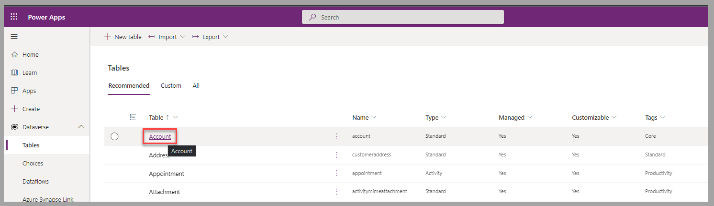
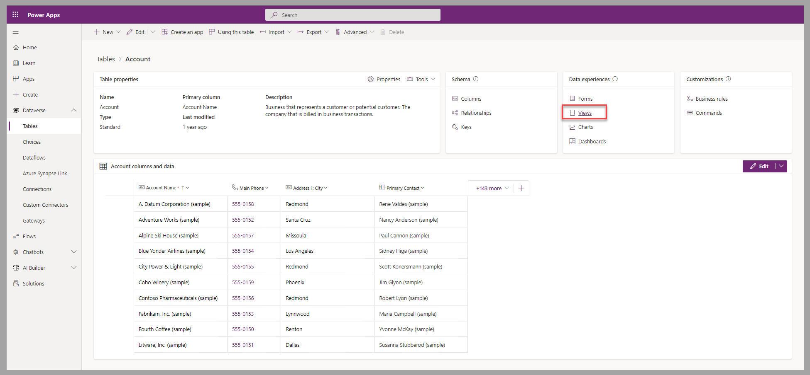
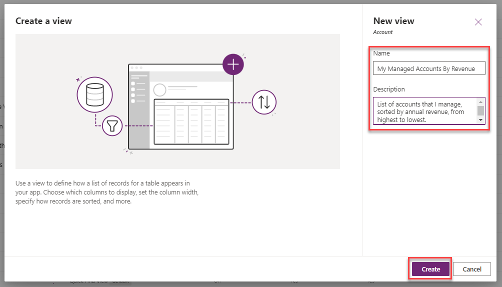
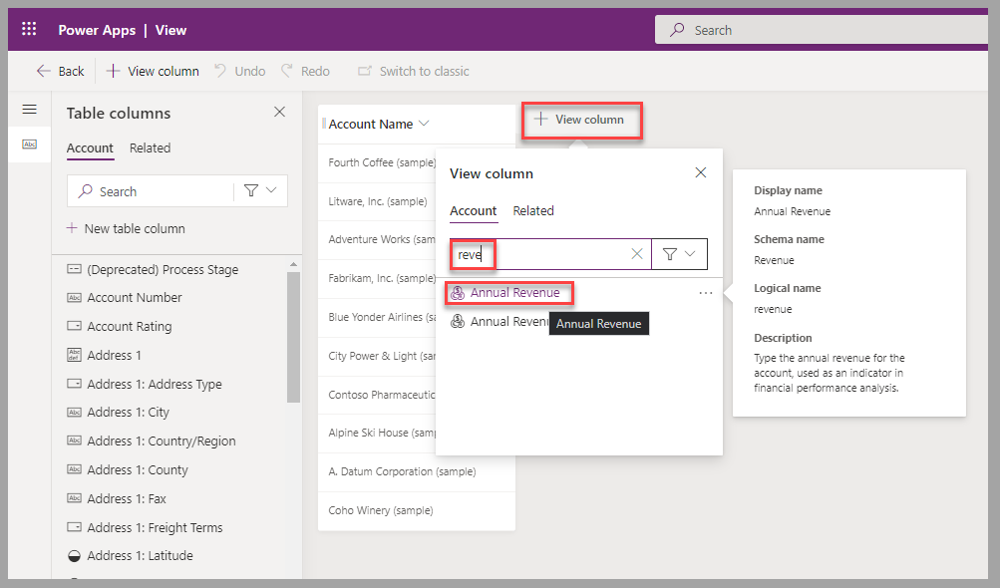
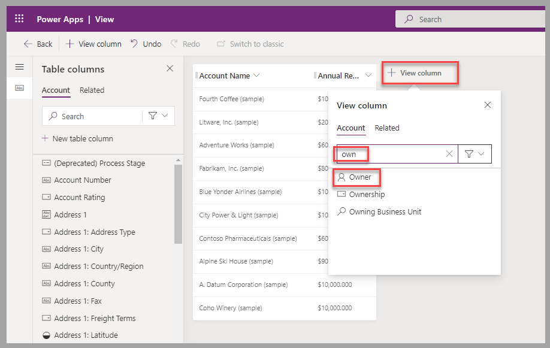
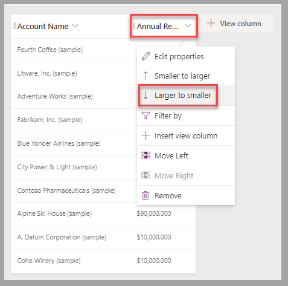
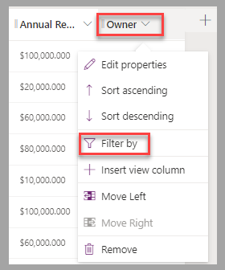
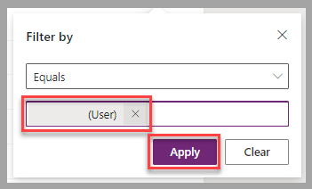
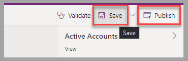

In this exercise, you'll apply your knowledge to create a view for accounts that you manage. Additionally, you'll ensure that the view shows the records as sorted from the highest annual revenue to the lowest.

Go to a Dataverse environment where you can modify the tables, such as dedicated training or development environment. Then, follow these steps to complete the exercise:

1. Sign in to [Power Apps portals](https://make.powerapps.com/?azure-portal=true).

1. In the left pane, expand **Dataverse** and then select **Tables**.

    > [!div class="mx-imgBorder"]
    > 

1. In the list of tables, select **Account**.

    > [!div class="mx-imgBorder"]
    > 

1. In Power Apps portals, for the Account table, select **Views**.

    > [!div class="mx-imgBorder"]
    > 

1. Select the **New view** option.

    > [!div class="mx-imgBorder"]
    > 

1. Define a **Name** and a **Description** for the new view. Select **Create** to proceed to the view designer.

    > [!div class="mx-imgBorder"]
    > 

1. Add columns to the view, including **Annual Revenue** and **Owner**.

    > [!div class="mx-imgBorder"]
    > 

    > [!div class="mx-imgBorder"]
    > 

1. Set the order of the records to display in order of revenue. Select **Annual Revenue** and then select **Larger to smaller**.

    > [!div class="mx-imgBorder"]
    > 

1. Filter the accounts to be displayed so that only the records that you manage are listed. Select the **Owner** column heading and then select **Filter by**.

    > [!div class="mx-imgBorder"]
    > 

1. In the list of users, select your name and then select **Apply**.

    > [!div class="mx-imgBorder"]
    > 

1. To apply changes and make them available to Power Apps users, select **Save > Publish**.

    > [!div class="mx-imgBorder"]
    > 

## Exercise steps (video)

Watch the following video for a demonstration of the steps that you've completed for this exercise.

> [!VIDEO https://www.microsoft.com/videoplayer/embed/RE59enu]

## Next steps

Now, you've learned how to add filter and sort criteria to a Dataverse table view. Next, you'll validate the learned concepts for this module.
