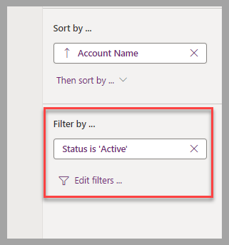
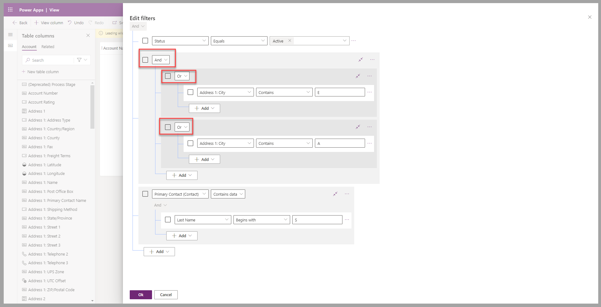
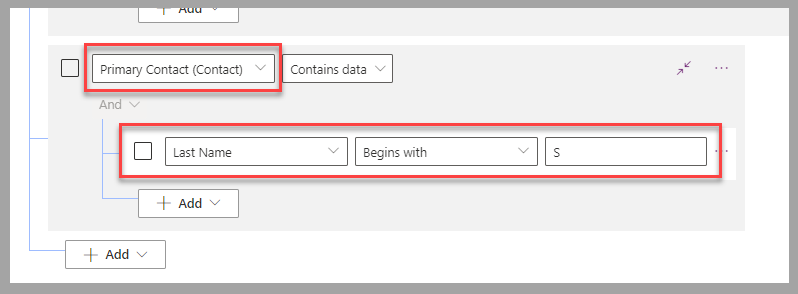
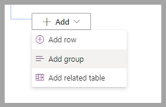
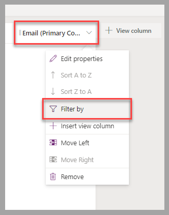
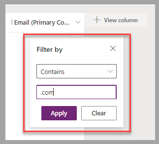
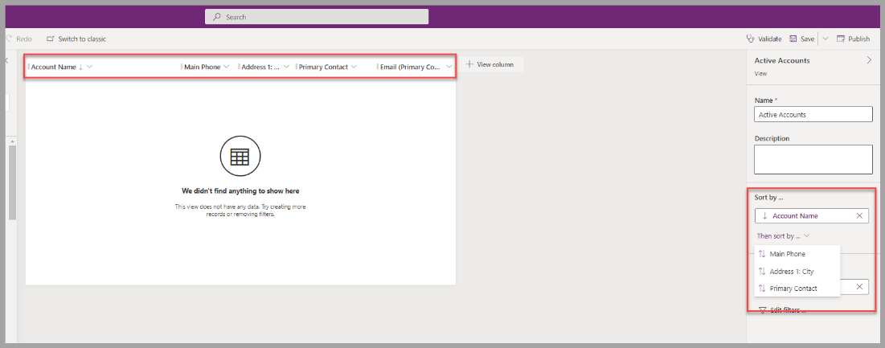
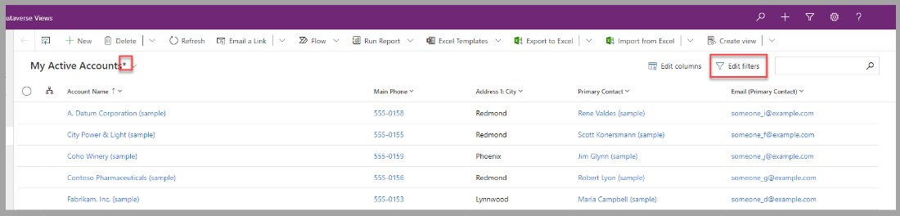
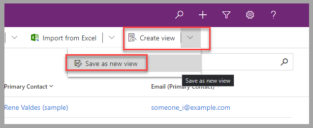

You've reviewed how to create and modify views and learned how to add or remove columns that are presented for the listed records. In this unit, you'll go through the steps to define which records this list should contain and in which order the records should be organized.

## Filter data

The process that you use to define which records will be part of a view will involve setting up the **Filter by** property of that view.

> [!div class="mx-imgBorder"]
> 

A filter is composed of one or multiple criteria that are applied against each record to determine whether it should be displayed or not. Basically, the record will be displayed when the criteria set is valid and won't be displayed if it's invalid. You can group the different rules and set them with an **Or** clause when either rule is valid. Alternatively, you can set with an **And** clause when all rules must be valid.

> [!div class="mx-imgBorder"]
> 

You can set the filtering criteria on columns of the table that the view is for or for columns of related records. For example, an **Account** has a **Primary Contact** that can be assigned. When using a filter criterion, you can filter records where the primary contact's last name begins with the letter *S*.

> [!div class="mx-imgBorder"]
> 

When you add a new criterion, three options are available:

- **Add row** - Add a single criterion.

- **Add group** - Group multiple criteria together.

- **Add related table** - Add rules against records that are related to the current one that's being evaluated.

    > [!div class="mx-imgBorder"]
    > 

From a simple criterion to a complex set of criteria, you can set a filter definition by using a series of logical operations that determine whether a record should be displayed.

The filter definition isn't limited to the visible columns of a view, but for those visible columns, a shortcut is available to add a **Filter by** criterion. By selecting the column heading in the view editor, you can select a menu option to define the rule to apply.

> [!div class="mx-imgBorder"]
> 

> [!div class="mx-imgBorder"]
> 

## Sort data

The list of records that are presented in a view are shown in a sequence based on the **Sort by** definition.

This definition is composed of a list of columns that must be part of the visible columns of the view and are processed one after the other.

> [!div class="mx-imgBorder"]
> 

You can sort each selected column in ascending or descending sequence. Set this configuration by selecting the column heading and then the type of sort sequence that's required.

> [!div class="mx-imgBorder"]
> 

## Modify filters and sort criteria in Power Apps

Users of model-driven apps can modify the filters and sort criteria in the application. They can select **Edit filters** to modify the criteria and apply the filter and sort criteria temporarily to the current view. An asterisk will be appended to the view name to indicate that such a change was applied.

> [!div class="mx-imgBorder"]
> 

For users who want to save a modified version of a view as a **personal view**, they can select **Save as new view** under **Create view**.

> [!div class="mx-imgBorder"]
> 

## Next steps

You've learned how to modify the list of records that are presented in a view by creating or editing the view's filter criteria. Also, you've learned how to apply a sorting order to that list of records. Next, you'll apply those learnings in an exercise that's applicable to the **Account** table.
