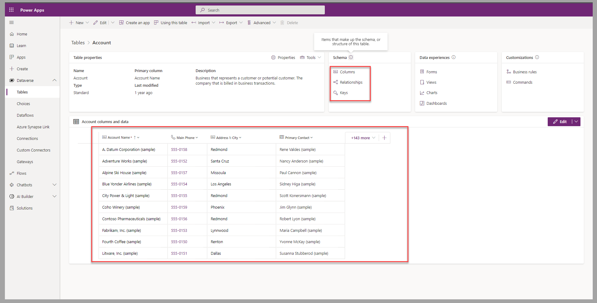
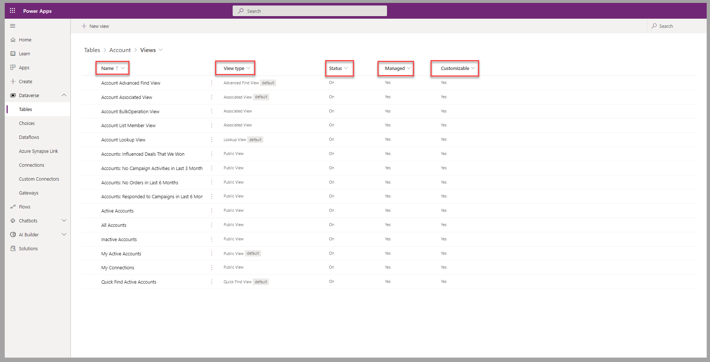
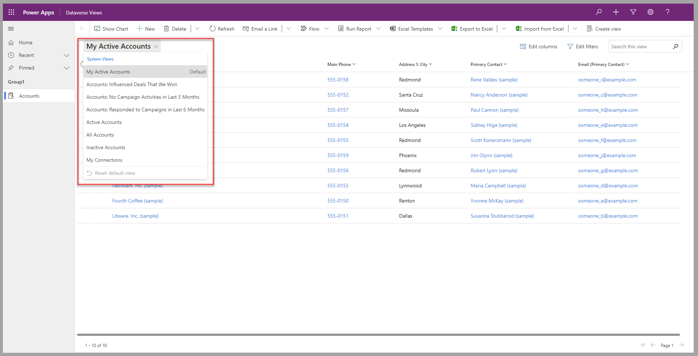
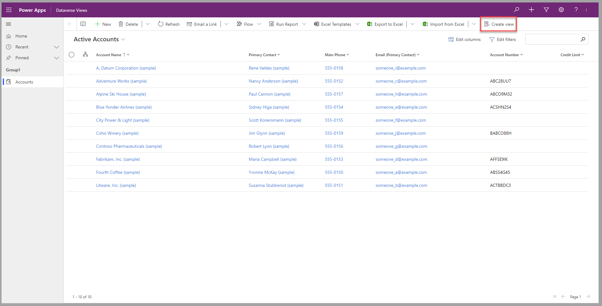
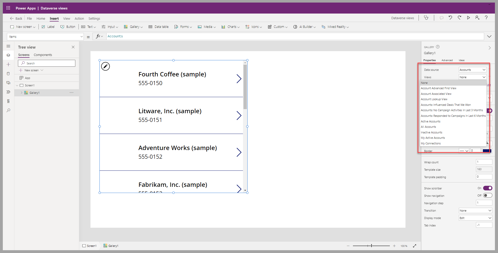

This self-paced module will help you learn how to take advantage of Microsoft Dataverse table views to visualize data by using only the required columns, records, and applicable sorting.

## Dataverse tables

Tables in a database system, such as Dataverse, provide a definition of the data that it contains. The data model that the tables are part of defines the relationships between different tables. Dataverse includes a series of standard tables that are already available and have been designed to follow common business scenarios and best practices. Additionally, you can create tables to suit custom scenarios, and you can tailor the system tables to adapt to those scenarios.

To view the tables in a Dataverse environment, follow these steps:

1. Sign in to [Microsoft Power Apps portals](https://make.powerapps.com/?azure-portal=true).

1. In the left pane, expand **Dataverse** and then select **Tables**.

    > [!div class="mx-imgBorder"]
    > 

1. In the list of tables, select a table to view its details or to customize. For example, you can select **Account**, which is a core table that the system provides during the provisioning of a new Dataverse database.

    > [!div class="mx-imgBorder"]
    > 

The table details that are provided (and available to edit) include the **Columns**, **Relationships**, and **Keys** schema that are responsible for the definition of the data structure and position of this table in the database model. A presentation of some records is displayed as a default view of that Dataverse table data.

   > [!div class="mx-imgBorder"]
   > 

## Dataverse table views

Based on the user who's accessing the data that's contained in the Dataverse tables, only a subset of columns and records might be required. Dataverse table views provide standardized and accelerated methods of accessing the data based on the user and/or applicable scenarios.

The three types of views are:

- **Personal** - This view is owned by individuals and is visible to other users whom it's shared with.

- **System** - Special views that Power Apps applications depend on. They're automatically created, and only users with the system administrator or system customizer security role can edit them. System views are defined as follows:

  - **Quick Find** - Use for searches in Power Apps applications.

  - **Advanced Find** - Use for searches in Power Apps applications.

  - **Associated** - Use to list records that are associated with another table's record.

  - **Lookup** - This system view is for lookup fields.

- **Public** - This view is created by individuals but is accessible by all app users. It's useful for organization-wide scenarios.

To access views in the maker portal, go to Power Apps portals. Then, for a selected table, select **Views**.

   > [!div class="mx-imgBorder"]
   > 

This selection will provide you with the list of views that are applicable to this table. This list displays the **Name**, the **View type**, and other key settings, such as the active **Status**, its **Managed** property, and whether it's **Customizable** or not.

   > [!div class="mx-imgBorder"]
   > 

## Views in Power Apps

Applications from Power Apps can take full advantage of Dataverse views for the tables that they refer to.

In model-driven types of apps, a view selector is available for users when they access the main page for a table.

> [!div class="mx-imgBorder"]
> 

Users of model-driven apps can also create personal views by selecting the **Create view** menu option.

> [!div class="mx-imgBorder"]
> 

In canvas apps, a view selector is available to the makers when they select a Dataverse table as a data source for a gallery.

> [!div class="mx-imgBorder"]
> 

## Next steps

Now that you've learned the fundamentals of Dataverse table views, you'll learn how to create and edit views in Power Apps maker portal.
