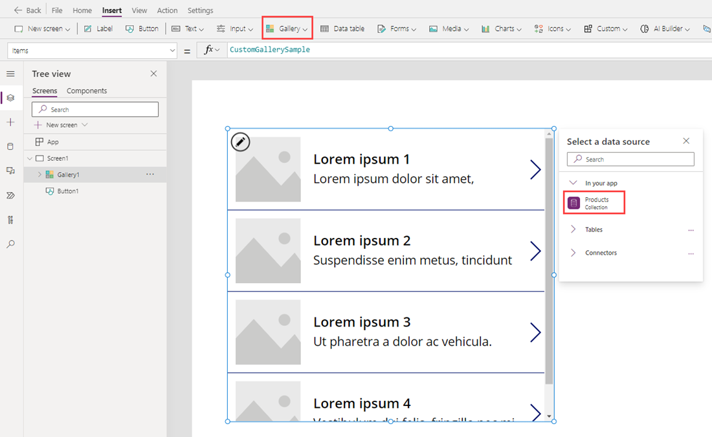
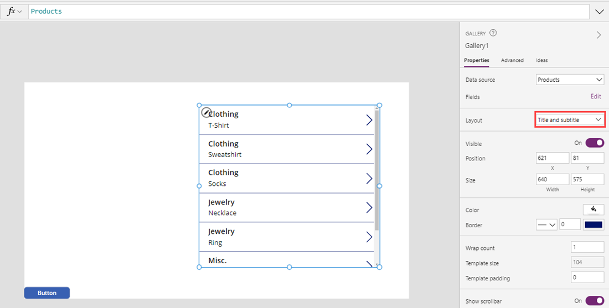
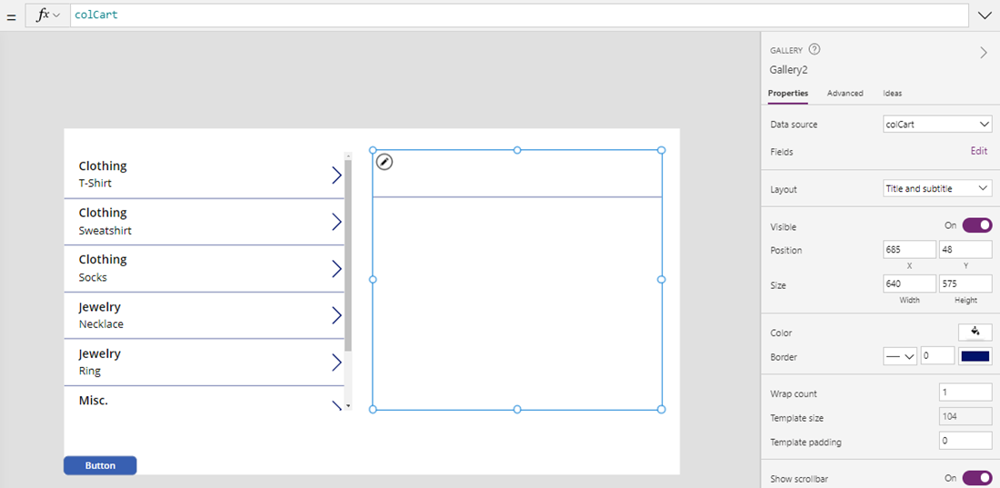
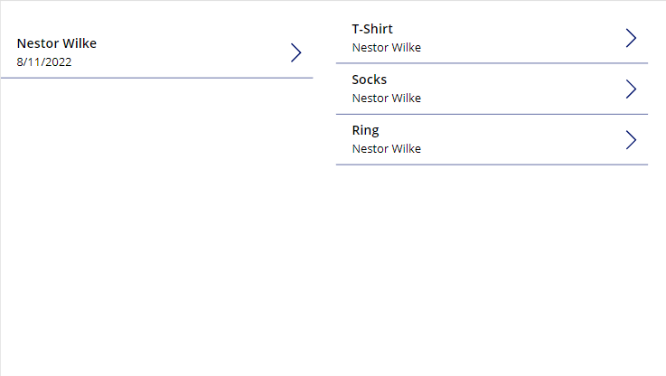

In this exercise, you'll learn how to access related data and how to create related records in multiple tables. For this example we'll be using [collections](/power-apps/maker/canvas-apps/create-update-collection/?azure-portal=true), which will only temporarily store your data. If you want a solution that saves to Dataverse or SharePoint, use the [Patch](/power-apps/maker/canvas-apps/functions/function-patch/?azure-portal=true) function.

We're going to create a shopping cart. We'll use a parent table (the receipt header), a child table (the receipt line items), and a products table (reference table). The relationships will look like this:


The diagram above shows three tables with primary keys, but the ReceiptLineItems table (on the right) has two foreign keys referring to the ReceiptHeader ID and the Products ID, respectively. The diagram symbols of the lines going from the ReceiptHeader and Products tables to the ReceiptLineItems table signify a one-to-many relationship, meaning that one ID field (from each) could be entered for many different items in the ReceiptLineItems.

Start Exercise
-------------

1. Go to [make.powerapps.com](https://make.powerapps.com/?azure-portal=true).

1. Select **+ Blank app**

1. Select **Create** under **Blank Canvas app**

1. Name the app **Shopping Cart**, ensure **Tablet** is the format, then select **Create**.

    

1. Now select **Insert** from the top menu and select **Button**.

1. In the **OnSelect** property of this button, input the following code (you can copy and paste):

    ```powerappsfl
    ClearCollect(Products,
     {ID:1, Name:"T-Shirt", Category: "Clothing"},
     {ID:2, Name:"Sweatshirt", Category: "Clothing"},
     {ID:3, Name:"Socks", Category: "Clothing"},
     {ID:4, Name:"Necklace", Category: "Jewelry"},
     {ID:5, Name:"Ring", Category: "Jewelry"},
     {ID:6, Name:"Coffee Mug", Category: "Misc."},
     {ID:7, Name:"Keychain", Category: "Misc."}
    )
    ```

1. Hold the **Alt** Key and select the button. You now have a collection in memory titled **Products** that will be the data for our first gallery. You can move this button out of the way.

1. Add a **Vertical Gallery** to the screen and select the **Products** collection as the data source.  Doing that replaces *CustomGallerySample* with *Products* in the **Items** property.

    

1. Change the **Layout** to **Title and Subtitle**.

    

1. Move your new Gallery to the far left side of the screen and set the **OnSelect** property of the gallery equal to:

    ```powerappfl
    Collect(colCart, ThisItem)
    ```

1. Now add a second vertical **Gallery** (Gallery2), with the Data source set as **colCart** and the **Layout** set to **Title and subtitle**. **Delete** the Right-pointing chevron icon from the gallery.

1. Position this gallery on the right side of the screen so that it looks like the screen below, with Gallery1 on the left and Gallery2 on the right:

    

1. Press your **Alt** key and select the Right-pointing icon in the top row of the Gallery1. Gallery2 should now have an item in it. You can continue to press your **Alt** key to select items from Gallery1 to populate Gallery2.

1. Now add a second **Button** to the screen. Make the *Text* property of the button "Check Out", and set the button's *OnSelect* property to the following formula (you can copy and paste):

    ```powerapps fl
    Collect(
      ReceiptHeader,
       {
            ID: If(
                IsEmpty(ReceiptHeader),
                1,
                Last(ReceiptHeader).ID + 1
            ),
            Name: User().FullName,
            Date: Today()
        }
    );
    ForAll(
        colCart,
        Collect(
            ReceiptLineItems,
            {
                ID: If(
                    IsEmpty(ReceiptLineItems),
                    1,
                    Last(ReceiptLineItems).ID + 1
                ),
                ProductID: ThisRecord.ID,
                ReceiptHeaderID: Last(ReceiptHeader).ID
            }
        )
    );
    Clear(colCart)
    ```

1. This code will create a single-item **ReceiptHeader** collection that includes information on the current user, the current date, and sets an ID for the user. Then for every item in **colCart**, it will add a line item to **ReceiptLineItems**. This line item will include an autonumbered ID field, the ID of the newly created **ReceiptHeader** record (that will tie the item to the buying event), and the ID of the product in colCart. It will then clear **colCart**, since it will be submitted. So you'll want to fill your cart prior to selecting!

1. Press your **Alt** key and select the "Check Out" button to load this collection.

1. Create a **New Screen** (Screen2) so we can have a fresh canvas to see what the newly created data looks like.

1. Go to your new screen and add two vertical **Galleries**, formatted the same way as the two on our last page. Set data source or *Items* property for the left **Gallery** (Gallery3) to **ReceiptHeader**, and select **ReceiptLineItems** as the source for the second **Gallery** (Gallery4).

1. On the left **Gallery** (Gallery3), change the **Text** property of the **Subtitle** to **ThisItem.Date**.

1. Go to the right **Gallery** (Gallery4) and modify the *Items* property to the following:

    ``` powerappsfl
    Filter(ReceiptLineItems, ReceiptHeaderID=Gallery3.Selected.ID)
    ```

1. Now (still in Gallery4), change the **Text** property of the **Title** to the following:

    ``` powerappsfl
    LookUp(Products, ID=ThisItem.ProductID).Name
    ```

1. Next (still Gallery4), change the **Text** property of the **Subtitle** to the following:

    ``` powerappsfl
    LookUp(ReceiptHeader, ID=ThisItem.ReceiptHeaderID).Name
    ```

1. You now have a functioning order history page, with the order header information on the left in Gallery3 and the items purchased on the right in Gallery4. You can select a **Receipt Header** item from left-hand side to see the line items from that receipt on the right.

    

You can go back to the first screen and select new items from Gallery1 to fill the cart (represented by Gallery2). Then you can press the *Check Out* button, go to Screen2 and see another order under your name. Selecting either order will show you the items purchased for that particular order.

You could continue to work on and complete your solution by adding more descriptive labels, navigation pieces, and defining what the user would do with an app like this.

Hopefully, you've now seen the possibilities of using relational data.  Though this far from a full solution, you can begin to see the possibilities of using techniques like this in your apps.
