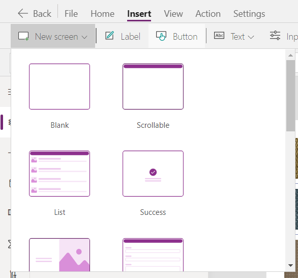
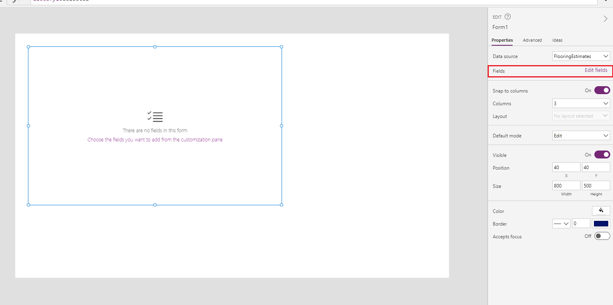

This hands-on lab shows you how to work with Forms to show and edit data. 

1. Start by downloading the [Flooring Estimates workbook](https://az787822.vo.msecnd.net/documentation/get-started-from-data/FlooringEstimates.xlsx) and save it to OneDrive for Business.

1. Go to [https://make.powerapps.com](https://make.powerapps.com/?azure-portal=true) and sign in with your organizational account.

1. On the Home screen select **Canvas app from blank**.

    

1. Name your app **New App** , format **Tablet** and click **Create**.

    

1. Select the data tab on the right hand side of the screen, select **+ Add Data**, search for **OneDrive** and select **OneDrive for Business**.

1. Select **Connect** and once prompted to connect to OneDrive, sign in using your organizational credentials.

1. Find and select the Flooring Estimates sheet. Select the Flooring Estimates table, and click **connect**.

1. Select the **Insert** tab and add a vertical gallery, set its **Items** property to **FlooringEstimates**.

1. Set the **OnSelect** property to the following:

    ```powerappsfl
    Navigate(Screen2)
    ```

    You can ignore the error that will be given, as it will be resolved in the next step.

1.  Select **New Screen** in the top left hand corner of the studio, and select **Blank**.

	

1. Select the **Insert** tab and add an Edit Form, set the **DataSource** property to **FlooringEstimates** and the **Item** property to **Gallery1.Selected**.

1. Select the **Edit fields** button on the right, and add all of the available fields.

	[](../media/edit-fields.png#lightbox)

1. Change the **OnSuccess** property of the form to the following:

    ```powerappsfl
    Navigate(Screen1, ScreenTransition.Cover); Notify("You have successfully submitted a record for " & Self.LastSubmit.Name)
    ```

1. Change the **OnFailure** property of the form to the following:

    ```powerappsfl
    Notify("Your data was not saved. Please try again or contact an administrator.", NotificationType.Error)
    ```

1. Select the **Insert** tab and add 2 buttons. Change the text of one to **New Form** and the other to **Submit Form**. 

1. Change the **OnSelect** property of the **New Form** button to the following:

    ```powerappsfl
    NewForm(Form1)
    ```

1. Change the **OnSelect** property of the **Submit Form** button to the following:

    ```powerappsfl
    SubmitForm(Form1)
    ```

1. Now go back to the first page and start using the app. Selecting a record in the Gallery should bring you to the form.

You have now successfully created a basic app utilizing the principles taught in this module. 
