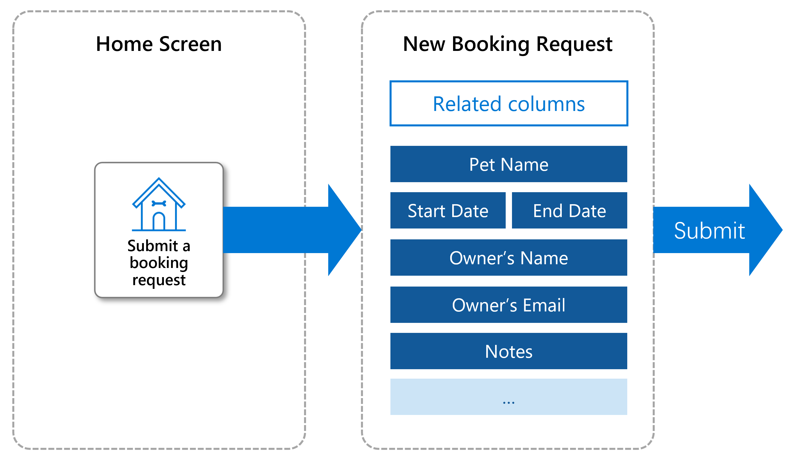

Contoso Pet Boarding needs an app that allows customers to submit booking requests. Here, you will create the table and columns needed to store the booking request information and build a canvas app for customers to use. You'll validate your app against requirements to check your work.

## Specification
Create a Power Apps canvas app called Contoso Booking Requests that meets these specifications:
- Create a custom table for Booking Requests that can store the following information: 
    - Start and End Dates
    - Pet Name
    - Owner’s Name and Email
    - Decision (with the option to choose between Undecided, Accepted, and Declined)
    - Notes
- The customer must provide the Start Date, End Date, Pet Name, Owner Name, and Email to submit a Booking Request.
- New Booking Requests should default to a decision of Undecided until a Contoso Pet Boarding employee reviews it.
- Employees can view all Undecided Booking Requests and update the Decision column to Accepted or Declined.
- Create your app for your new custom table that allows users to create Booking Requests. The following wireframe shows a mockup of your canvas app:
    

## Check your work
To validate that you have completed the work to the requirements, test your app behavior out by following these steps.
1. Run your app. Create a new booking request with the Start Date, Pet Name, Owner Name, and Email populated, leaving the End Date blank. Submit the request to verify that the user cannot submit a request without the End Date populated.
2. Run your app. Create a new booking with the Start Date, End Date, Pet Name, Owner Name, and Email populated. Submit the request to verify that the user can submit a request when all the required information is provided.
3. View the Booking Request that you created. Verify that the Decision column is set to Undecided. Update the column to Accepted.

  > [!TIP]
  > If you get stuck here, reviewing [How to build a canvas app](/training/modules/build-app-solution/?azure-portal=true) may help. Remember that you can view your Booking Request data by going to [www.make.powerapps.com](https://make.powerapps.com/?azure-portal=true) and selecting Dataverse > Tables > Booking Requests.
