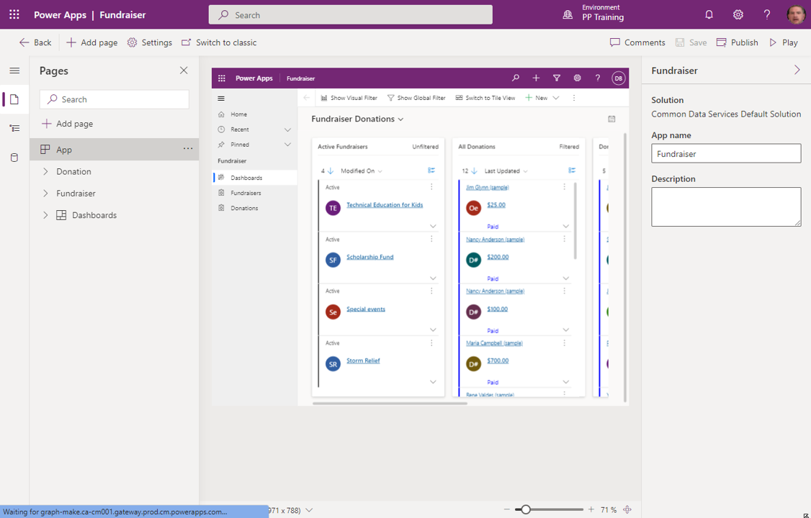
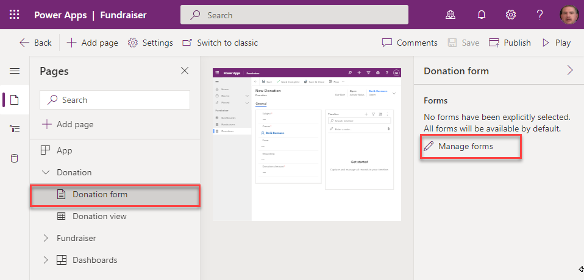
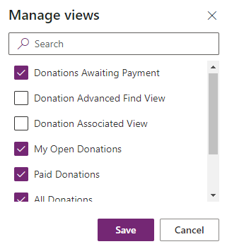
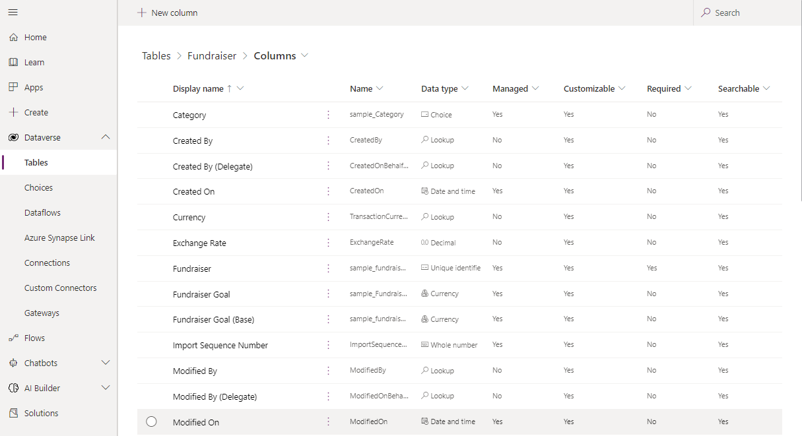

Here is a quick look at the App Designer for an example Model-driven app called
“Fundraiser.” This application includes two tables: Donation and Fundraiser.

For each table, you'll be able to specify the following:

-   **Forms** – Defining how users will see and interact with the data

-   **Views** – A list view of the rows for each table

Based on what option you have selected; you can specify which specific forms and
views to include for that table by selecting the table form or view and choosing
either **Manage forms** or **Manage Views**.

For example, in a fundraiser application you might want to have an account form
that includes fundraising details such as tax exemption status. However, in
another application like an innovation application, your account form wouldn't
need those fields so you might have a version of the form where those fields are
not included.

You can include multiple forms and views per table. For example, in the screenshot below, we're including multiple views to help manage donations. If you do not select any view or forms, the system will assume that you want to include all items.

## Add new content to an application

New content is added to the application by selecting the **Add** page button.
When you add a new page, you specify which type of page you want to use.

There are three options to choose from:

-   **Table based form and view:** Display records of table in a full-page list
    view. Forms associated with that table are also included.

-   **Dashboard:** Displays charts and tables from multiple entities to
    visualize data on a single page. Multiple dashboards can be added to a model
    application.

-   **Custom:** Allows you to design and build the type of page you want by
    dragging interactive components into the canvas.

## Testing the application

By selecting the **Play** button in the top right, the app is put into **Play
mode**. You can see the app that displays the data based on the
choices made in the design process.

In the example above, for the Fundraiser table, there are several pieces of data
being collected, such as:

-   Name

-   Fundraiser Goal

-   Owner

-   Total Donations

-   Created On

### Data model

As you begin the data modeling process, there are a couple of important
questions to ask yourself:

-   What type of data will your solution be storing and or collecting?

-   How will this data relate or coincide with the other data you're working
    with?

These questions are important when designing a model-driven application because
of how model-driven applications function. Remember, model-driven applications
use a metadata-driven architecture. This means a large portion of the
model-driven app is based on how your data is modeled. There is no need to
write custom code to alter the app design.

You can view the app metadata by reviewing the Table in Microsoft
Dataverse.

As you think about your data model, also think about data types. When adding
columns to your table in Microsoft Dataverse, the data type you choose will
determine how users enter and view that in your model-driven app. Choices show
as dropdowns, currency shows with currency symbols, while decimal numbers don’t.
These little changes in the table can have a profound effect on how your user
experiences your app.

The screenshot below shows examples of columns and the different data types they
could have using the Fundraiser example again.

>[!IMPORTANT] 
>   If a column needs to be changed to a different data type, (i.e.
>   text column to a choice column), then you will need to delete that column
>   and recreate with the correct data type. This will cause you to lose any
>   data associated with that column.

## Understand the needs of the user

With model-driven apps, the name says it all. Your primary design goal is to get
your Microsoft Dataverse data model in order. With that in place, you can
connect Power Apps, and a model-driven app will be created for you from that
model.

Model-driven apps are created using the App Designer. You will choose the
tables, dashboards, business process flows, forms, and other components that
you want to make available in your app, and then the app will be created for
you. This means you will need to spend more time understanding what your user
needs than how it is going to look.

### Business Logic

When incorporating business logic in your app, there are two primary options
available. You can set **Business Rules** on your Microsoft Dataverse tables or
you can build **Business Process Flows**.

With **Business Rules,** you will define behaviors at the data layer. Business Rules are
great for setting conditions for when a field is required, setting a default
value, or even showing or hiding a field based on criteria. An example could be
a table for tracking expenses. You could have a column for type of travel and
then build a business rule that dictates that if a user chooses automobile then
the mileage field is required, else it is optional. This gives you the power to
make sure you maintain data consistency in all scenarios.

**Business process flows** are used to guide users through using your app. These
workflows can provide visuals on next steps based on the status of the data and
facilitate other actions that you want to occur as the user uses the app.
Business Process Flows let you bring automation to your app and make it more of
a guided experience than just a place to enter data. If you would like to go
more in-depth with Business Process Flows, see the learning path [Create a business process flow in Power Automate](/learn/paths/create-business-process-flow/).

### Dashboards

A common output need for apps is to visualize the data. For this requirement,
you can implement dashboards with custom filters and visual graphics to tie all
this data together right in your app. When creating your dashboards, make sure
they are simple for your users to consume without overwhelming them with all the
data. Provide high-level snapshots of your data and allow them to use filters to
dive deeper into the data if needed.

### Additional third-party solutions and app accelerators

It is also important to know about the different App accelerators and
third-party solutions available to you. Depending on the industry you are in,
Health, Financial, Banking, Education, Non- Profit, Automotive, or Media,
Microsoft has released a number of accelerators or foundational components to
assist you with quickly standing up your solution. For more information, see
[Industry accelerators
overview](https://docs.microsoft.com/common-data-model/industry-accelerators?azureportal=true).
