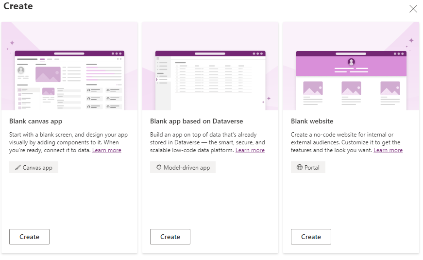
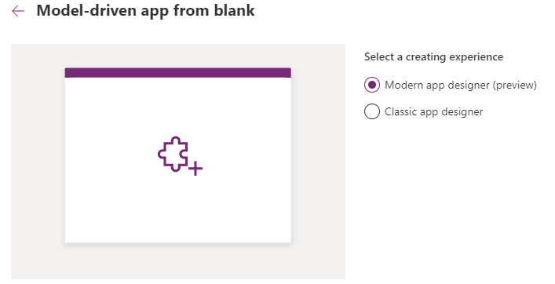
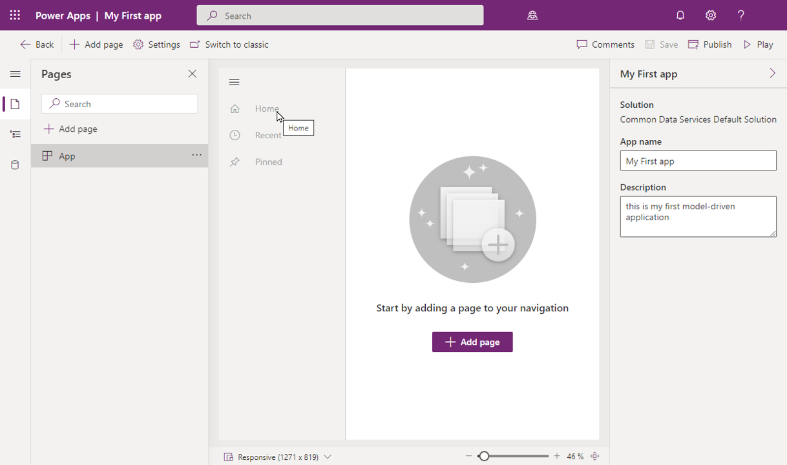
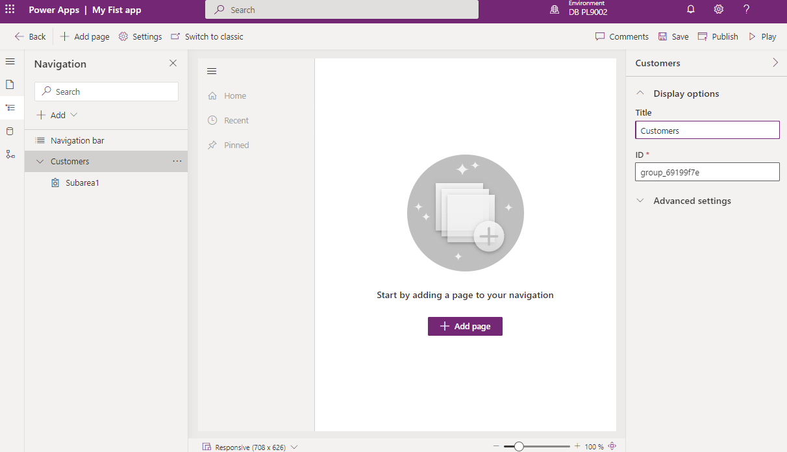
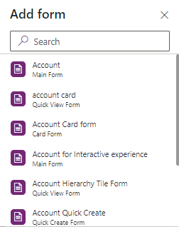
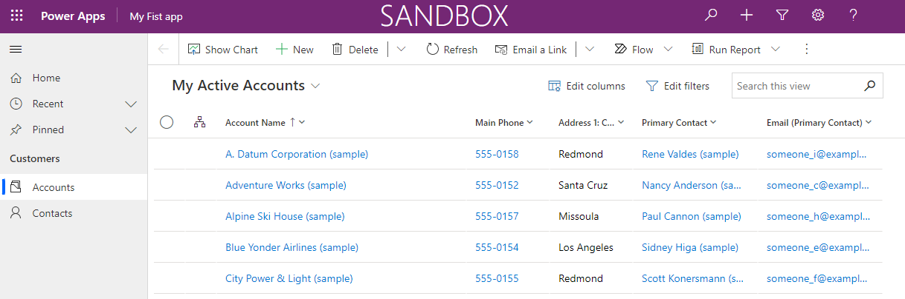

In this unit, you will create a model-driven app by using one of the standard
entities that is available in your Microsoft Power Apps environment.

## Create a model-driven app

1.  Sign in to [Power Apps](https://make.powerapps.com/) by using your
    organizational account.

2.  Select the environment you want, or go to the [Power Apps admin
    center](https://admin.powerapps.com/) to create a new one.

3.  On the **Home** page, select **Blank App**.

4.  On the Create screen, select **Blank app based on Dataverse**, and click
    **Create**.

    

5.	Select Modern app designer (preview), and click Create.

    

6.  On the **New model-driven app** page, enter a **name** and **description**
    for the app. (*For example, enter My first app for the name, and this is my
    first model-driven application for the description.*)

7.  After a few minutes, you new app will appear.

    

## Add Account table to your app

You can add pages to your app by using the App Designer.

1.  If necessary, using the navigation on the left, select the **show or hide
    menu names button** (looks like 3 horizontal lines) to show the menu names.

2.  Select **Navigation**.

3.  Select the **Group1** text. On the right-hand side of the screen change the
    Title to **Customers**.

    

4.  Under the **Customers** group, select **Subarea1**.

5.  On the right-hand side of the screen set the Content type field to Table.

6.  On the **Table** field that appears, select **Account.**

7.  Set the Title field to **Accounts**.

## Add forms and views to your app

Now that we have added a table to our app, we are going to specify which Account
forms and views should be used with the application.

1.  Using the navigation on the left, select **Pages.**

2.  Expand **Account** and select **Account** form.

3.  On the right-hand side of the screen, select **Manage forms**.

4.  From the list of Forms that appears, select **Account,** and then select the
    **Save** button.

    

5.  Under **Pages** on the left, select **Account** view.

6.  On the right-hand side of the screen, select **Manage Views**.

7.  Select the following views:

    -   My Active Accounts

    -   Active Accounts

    -   Inactive Accounts

## Add Contact page to your app

Next, we are going to add another table to our application. In this case we are
going to add the Contacts table since a customer could be either an account or a
contact.

1.  On the command bar at the top, select the **Add Page** button.

2.  On the Add page screen, choose **table based view and form**, then select
    the **Next** button.

3.  In the **Search** field, enter **Contact**, then select the **Contact**
    table.

4.  Select the **Add** button.

## Save and publish your app

Now that you have successfully created your first model driven application,
let’s get ready to use it.

1.  Using the command bar at the top select the **Save** button.

2.  Once your application have been saved, select the **Publish** button.

3.  To test your application, select the **Play** button.

    